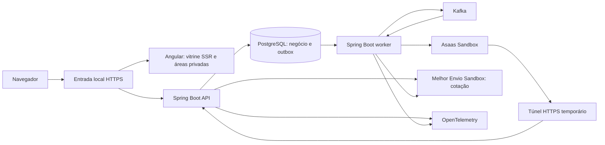

# De Lá do Pará — plano mestre de execução

Documento autossuficiente para um executor de código com contexto limitado. Data de consolidação: 20/09/2026. Contém todas as decisões e os oito documentos de planejamento, com referências internas e complementos de execução/CI/CD.

**Estado atual:** execução autorizada; consultar `tasks/progress.md` e `docs/traceability.md` para estado local/remoto de cada etapa. Não repetir perguntas já respondidas em D01–D65.

## Índice de leitura

1. [Instruções ao executor](#executor)
2. [Clone obrigatório e início](#clone)
3. [CI/CD, manutenção e commits](#pipeline)
4. [Pendências reais e ordem de revisão](#pendencias)
5. [Referência LAPES e práticas atuais](#referencia)
6. [Decisões completas](#decisoes)
7. [Mapa de capacidades](#mapa)
8. [Catálogo e embalagens](#catalogo)
9. [Nome e pesquisa preliminar](#nome)
10. [Design e vídeos](#video)
11. [Documentação da API e testes](#api-testes)
12. [Plano técnico completo](#plano)
13. [Backlog integral e commits](#backlog)
14. [Checklist de encerramento](#encerramento)

<a id="executor"></a>
## 1. Instruções ao executor

### Objetivo

Construir do zero uma loja única de produtos paraenses chamada **De Lá do Pará**, para portfólio local, sem custo de serviços. Spring Boot + Angular; monólito modular com API e worker separados; PostgreSQL; checkout confiável com Kafka; integrações Asaas/Melhor Envio em sandbox; identidade editorial própria. O produto deve ser bonito em vídeo e tecnicamente demonstrável. Documentação da API e testes são prioridades explícitas do usuário.

### Regras de interpretação

- Este arquivo é suficiente para retomar o projeto: não depender do histórico do chat, de memória do modelo ou da existência da pasta de documentos original.
- Requisitos adicionais desta consolidação: clone do **novo** repositório em `/home/gaalbu/codigos`, pipeline CI/CD obrigatória, documentação verificada, commits limpos e código enxuto. Eles atualizam trechos anteriores que chamavam CI de opcional.
- As decisões D01–D65 são fatos aprovados. Entradas antigas descrevem a evolução; quando houver sobreposição, a decisão mais recente e específica prevalece. D45 define o nome, D54 os preços/validades, D57 medidas, D58–D60 proteção/caixas, D61 arquitetura, D62 monorepo, D63 documentação/testes, D64 autenticação e D65 procedência/remoção de produtores.
- A01/A03/A05/A06/A07/A10 são propostas técnicas detalhadas. Validar compatibilidade e registrar em ADR nas etapas indicadas; não apresentá-las como respostas explícitas do usuário. Decisões comerciais ou arquitetônicas ainda ambíguas devem ser perguntadas, uma de cada vez, com opções e recomendação. Não transformar silêncio em aprovação.
- Dados de preços, produtores, lotes, embalagens e origem da demonstração são fictícios ou referências de teste identificadas. Não alegar proteção física de embalagem, segurança alimentar, operação em produção ou disponibilidade de marca.
- Não copiar código, identidade, namespace, dados pessoais, credenciais ou histórico Git do LAPES Commerce. Usar apenas os aprendizados funcionais descritos neste documento.
- Não executar publicação no LinkedIn, deploy cloud, compra de domínio ou serviço pago como parte deste plano. Repositório público e CI/CD estão no escopo da futura implementação; não foram criados nesta consolidação.

### Ciclo obrigatório por tarefa

1. Ler esta seção, o registro de progresso e apenas a spec/módulo/tarefa relevante. Não reler todo o documento a cada pequena mudança.
2. Conferir `git status --short`, branch, remoto e último SHA antes de editar. Preservar mudanças do usuário. Não usar reset/clean/force-push para resolver dúvidas.
3. Selecionar o primeiro ID pendente com dependências concluídas. Trabalhar em uma intenção por vez, em branch curta.
4. Criar/revisar spec antes de implementação: objetivo; comandos; estrutura; convenções; estratégia de testes; limites; critérios identificados e exemplos de erro. Obter revisão quando a spec introduzir decisões ainda não aprovadas; não pedir novamente pelas decisões D01–D65.
5. Definir contrato e exemplos. Para comportamento, escrever teste que falha pelo motivo esperado; implementar o mínimo e refatorar com o teste passando.
6. Atualizar documentação e exemplos no mesmo conjunto da mudança. Cada endpoint deve ter teste HTTP e contrato; cada regra crítica deve ter teste de limite/falha.
7. Rodar os gates previstos e revisar o diff. Não pular testes para economizar tempo; não alegar aprovação se Docker, navegador, sandbox ou ferramenta não executou.
8. Fazer commit atômico com mensagem descritiva. Não dividir teste da correção em commits que deixem main quebrada.
9. Registrar ID, requisito, arquivos, comandos, resultado real, SHA e próximo passo. Atualizar o progresso apenas depois da evidência; marcar bloqueio sem marcar a tarefa concluída.
10. A cada até três commits funcionais, executar o checkpoint; nos marcos G0–G9, executar gates completos aplicáveis e validar a jornada.

Se uma tarefa exigir mais de aproximadamente cinco arquivos manuais ou mais de uma intenção independente, dividi-la em sufixos antes de codificar. Bootstrap gerado é exceção documentada. A contagem de commits é uma previsão, nunca uma meta artificial.

### Registro para continuidade

Criar no clone `tasks/progress.md` e manter ao final de cada sessão:

| Campo | Conteúdo obrigatório |
|---|---|
| Base | branch, SHA inicial/final, versão deste plano |
| Tarefa | ID, critério da spec, estado pendente/em execução/bloqueado/concluído |
| Mudanças | arquivos e comportamento entregue |
| Verificação | comando exato, exit code, relatório e limitações |
| Remoto | URL do PR, SHA e checks observados; separar resultado local de CI |
| Próximo passo | próximo ID elegível e menor ação concreta |
| Perguntas | apenas dados/decisões realmente ausentes |

Criar também `docs/evidence/<marco-ou-release>/` e a matriz requisito → spec → teste → commit → evidência. Não registrar tokens, CPF, senhas, URLs de acesso a pedidos ou payloads pessoais. Planejamento aprovado não significa teste aprovado.

### Código enxuto e commits limpos

- Nomes e código em inglês; comunicação, guias e textos da loja em pt-BR. Uma responsabilidade clara por módulo/classe/função.
- Sem camadas genéricas para um único uso, interfaces vazias, wrappers sem benefício, código morto, comentários que repetem o código ou dependências para operações triviais.
- DTOs nas bordas; invariantes no domínio/aplicação; contratos públicos entre módulos; nenhum acesso direto ao repository de outro módulo.
- Não usar `any`, casts ou supressões como atalho; não engolir exceções nem converter erro em sucesso.
- Formatação automática, lint e análise estática. Refatorações mecânicas separadas de mudança de regra. Nunca instalar ferramentas globais à revelia do usuário.
- Conventional Commits: `feat`, `fix`, `test`, `docs`, `refactor`, `build`, `ci`, `chore`, com escopo e intenção concretos. Usar as mensagens do backlog como base, ajustando ao que realmente foi feito.
- Não acrescentar `Co-Authored-By` de IA nem rodapé de geração. Não reescrever commits públicos para limpar histórico sem autorização específica. Evitar `git add .`; revisar e stagear arquivos pertinentes.
- PR pequeno, com objetivo, critérios, docs alteradas, comandos/resultados, screenshots quando houver UI e riscos reais. Não fazer merge automático; a política do repositório e a autorização do usuário governam merge.
- Rodar `aislop` local fixado para TypeScript quando disponível e revisar manualmente Java. Se não disponível, registrar limitação; não fingir scan. Ferramenta não substitui revisão de comportamento.

<a id="clone"></a>
## 2. Clone obrigatório em `/home/gaalbu/codigos`

**O executor deve fazer o clone do novo repositório público nessa pasta.** Destino proposto: `/home/gaalbu/codigos/de-la-do-para`. Nome técnico do repo, owner/URL e namespace Java devem ser confirmados no começo da execução, pois não foram fornecidos. O nome de vitrine De Lá do Pará já está aprovado e não precisa ser perguntado outra vez.

1. Inspecionar se o destino existe. Se existir, verificar `git -C <destino> remote -v` e `git status`; não sobrescrever, apagar, inicializar por cima ou clonar dentro de um projeto existente.
2. Confirmar o remoto novo com o usuário, ou obter owner e nome para criá-lo na fase de execução. **Não clonar LAPES como base**, não fazer fork dele e não copiar seu `.git`.
3. Criar o repositório público vazio quando autorizado na execução; então realizar clone. A permissão atual é consolidar este plano, portanto não executar a criação agora.
4. Com URL real confirmada, o roteiro de clone é:

```bash
cd /home/gaalbu/codigos
git clone <URL_CONFIRMADA_DO_NOVO_REPOSITORIO> de-la-do-para
git -C /home/gaalbu/codigos/de-la-do-para remote -v
git -C /home/gaalbu/codigos/de-la-do-para status --short
```

O token `<URL_CONFIRMADA_DO_NOVO_REPOSITORIO>` é um marcador, não um comando pronto. Nunca executá-lo literalmente. Se o usuário escolher outro nome, substituir o destino de forma consistente.

5. Versionar este plano no clone como `docs/PLANO-MESTRE.md`; criar os documentos operacionais derivados conforme o backlog. Eles podem ser extraídos das seções incorporadas abaixo; não dependem dos arquivos originais.
6. Criar o registro de decisões/ADRs e de progresso, `.gitignore` e `.env.example` sem valores secretos. Credenciais reais ficam somente no ambiente local apropriado.
7. Confirmar pré-requisitos e recursos: Git, Docker/Compose, JDK/Maven wrapper, Node/npm compatíveis, portas livres e RAM disponível. Registrar versões e consumo inicial. Se a máquina não comportar algum perfil, apresentar redução de serviços opcionais, preservando os componentes necessários aos testes críticos.
8. Subir perfis `local` determinístico, `sandbox` opt-in e `observability`/`load` opcionais, conforme o plano técnico. API e worker compartilham a mesma versão de artefato. Sandbox nunca é substituído por mocks na evidência de homologação.

<a id="pipeline"></a>
## 3. CI/CD obrigatória e manutenção contínua

### 3.1 CI em pull requests e main

Implementar GitHub Actions cedo (C13 e complementos), com comandos iguais aos locais, versões fixadas e artefatos por SHA. O orçamento de serviços é zero: usar runners padrão elegíveis e verificar regras vigentes de consumo/armazenamento antes de ativar; não ativar runners pagos ou cobrança automática. A disponibilidade de funcionalidades deve ser verificada na conta real.

| Check estável | O que deve comprovar |
|---|---|
| `commit-policy` | Mensagens no formato acordado, PR com tarefa/critério e ausência de resíduos/secrets |
| `docs` | Markdown, links internos, exemplos, referências de specs e matriz de rastreio coerentes; documentação de endpoint atualizada |
| `contracts` | OpenAPI/AsyncAPI/JSON Schema válidos; exemplos válidos; cliente reproduzível; rotas não documentadas e schema drift detectados |
| `backend` | Formatter, análise estática Java, JUnit, arquitetura e integração PostgreSQL/Kafka via Testcontainers; JaCoCo por módulo crítico |
| `frontend` | `npm ci`, tipos/templates strict, lint, formato, testes de componentes e build SSR |
| `journeys` | Stack real local com provedores simulados, Playwright e axe; compra, conta, admin, erros e recuperação relevantes |
| `security` | Segredos, dependências e imagens; achados triados; crítico/alto bloqueia até correção ou exceção específica revisada e com validade |
| `quality-gate` | Agregação explícita: todos os checks exigidos para a mudança passaram, sem transformar falha/cancelamento em sucesso |

Antes de tornar checks obrigatórios em proteção de main, executar um PR real e confirmar seus nomes e resultados. Exigir branch atualizada e checks verdes; configurar revisão humana de forma viável para projeto individual. Não alegar branch protegida apenas porque um arquivo YAML existe.

Em mudança somente documental, selecionar jobs de modo explícito: o agregador distingue `not applicable` de falha e mantém validação de docs/contratos quando afetados. Alteração de workflow, lockfile ou biblioteca compartilhada executa o conjunto necessário, sem bypass por filtro de caminho.

- Fixar actions por SHA completo e comentar versão de referência; ferramentas e imagens com versões/digests revisados, sem `latest` flutuante no gate.
- `permissions: contents: read` por padrão; elevar somente no job de entrega que realmente precisa escrever. Não executar código de PR externo com segredos via `pull_request_target`.
- Concurrency cancela runs antigos da mesma branch; definir timeouts por job e retenção curta de artefatos. Cache por lockfile, sem mascarar resolução ou build.
- Publicar relatórios JUnit, cobertura, traces/screenshots Playwright e logs sanitizados também em falha; não publicar segredos nem dados de sandbox.
- Uma falha no gate exige correção. Nunca remover testes, reduzir meta, ativar `continue-on-error` em gate obrigatório ou ignorar vulnerabilidade para obter verde.

Fontes verificadas para a implementação dos workflows: [sintaxe GitHub Actions](https://docs.github.com/en/actions/reference/workflows-and-actions/workflow-syntax), [uso seguro e pinagem](https://docs.github.com/en/actions/reference/security/secure-use), [cobrança e limites](https://docs.github.com/en/billing/concepts/product-billing/github-actions). Revalidar na execução.

### 3.2 CD compatível com aplicação local e custo zero

CD aqui é **entrega contínua de artefatos reproduzíveis**, com implantação de validação em ambiente efêmero e instalação local documentada. Não pressupõe servidor cloud nem acesso remoto à máquina pessoal.

- Em tag de release `v*` autorizada ou disparo manual com SHA aprovado: conferir proveniência da revisão, executar gates de release, buildar as imagens da API/worker e frontend a partir dos lockfiles, gerar checksums, SBOM, manifesto com versões e relatório.
- Subir essas mesmas imagens em ambiente efêmero do runner com PostgreSQL/Kafka e provedores simulados; aplicar migrations, fazer smoke de saúde e uma jornada de compra; destruir apenas os recursos efêmeros do job.
- Disponibilizar artefatos associados ao SHA/tag com retenção e tamanho controlados. GitHub Release pode ser preparada como rascunho; publicação final e registro externo de imagens dependem do destino acordado. O sucesso do build não autoriza cloud deploy.
- Guia local deve mostrar carregamento das imagens, configuração local, migration, health, smoke, backup e recuperação. Não executar scripts de terceiros nem instalar um runner persistente na máquina pessoal automaticamente.
- Rollback de aplicação não significa rollback seguro de banco. Seguir migrations compatíveis e o runbook de restore/reconciliação; manter efeitos financeiros pausados após restaurar snapshot antigo até reconciliar provedores.
- Homologação Asaas/Melhor Envio é manual/opt-in com credenciais do usuário e túnel temporário. Não rodar teste de carga nos sandboxes nem expor tokens em workflows públicos. Falha ou falta de credencial bloqueia só o gate externo, mas release não deve se declarar plenamente homologada.

### 3.3 Manutenção

- Dependabot ou ferramenta equivalente para Maven, npm, actions e imagens: atualizações em PRs pequenos, agrupamento sensato, majors separados; sem auto-merge sem política aprovada.
- Execução agendada para testes críticos, contratos e auditoria de dependências; frequência inicial semanal como proposta operacional a confirmar em C13c. Verificação de links externos também periódica, distinguindo erro transitório de link quebrado.
- Corrigir teste instável, não ocultar; manter reprodução e issue com causa. Revalidar versões antes de upgrade, incluindo compatibilidade Java/Boot e Node/TypeScript/Angular.
- ADR curto para cada nova dependência estrutural: problema, alternativas, custo operacional, decisão e evidência. Tendência de mercado não justifica adicionar serviço sem uso claro.

<a id="pendencias"></a>
## 4. Pendências reais: resolver na etapa correspondente

Não criar uma nova sequência interminável de perguntas sobre preferências já aprovadas. Preparar propostas concretas antes de perguntar. Estas pendências não autorizam inferências silenciosas:

| Pendência | Momento | Ação do executor |
|---|---|---|
| URL/owner/nome técnico do repo e namespace | C00a/C00b/C05 | Pedir informação ausente, então criar/clonar na pasta autorizada |
| Aprovação final das specs e propostas técnicas ainda abertas | C01/C02 e spec do módulo | Mostrar fronteiras, contratos e alternativas em bloco pequeno; aplicar decisões existentes |
| Tons exatos, fontes, imagens licenciadas e protótipo | C03 | Preparar proposta concreta com contraste/licença; revisar com usuário antes do frontend final |
| Storyboard com cortes/legendas e roteiro técnico | C03, C96a/C96b | Sequência e formatos já aprovados; revisar somente os detalhes concretos |
| Credenciais, dados de remetente aceitos no sandbox, acesso ao túnel | C04 | Pedir ao usuário; CEP e ponto fictício aprovados não fornecem CNPJ/CPF/endereço completo real |
| Capacidade real das integrações e idempotência de provedores | C04/C53/C65 | Verificar docs oficiais e sandbox, registrar limitação, não inventar garantias |
| Calendário concreto de feriados, lotes/estoque inicial e regras de datas | Specs inventory/shipping | Propor fixtures reproduzíveis e calendário com fonte; confirmar o que muda a regra comercial |
| Prazo de guarda da retirada, não comparecimento, validade na retirada tardia | Specs orders/shipping | Formular pergunta antes de implementar expiração/descarte/reembolso automático |
| Decisões administrativas após despacho parcial | Specs checkout/payments/shipping | Após um pacote ser entregue à transportadora, os demais continuam por padrão; pausar exige decisão administrativa, sem cancelamento ou reembolso automático ou parcial (D68) |
| Política de reserva/liberação do contador global de cupons | Spec pricing | Reutilização por e-mail após reembolso já aprovada; documentar sem inferir reset ilimitado global |
| Licença do código público, destino final de releases e publicação | Preparação do repositório/release | Perguntar; repo público não implica licença escolhida, marca livre ou publicação de vídeo autorizada |

Versões, scripts e ferramentas serão fixados no bootstrap a partir de documentação atual; os comandos abaixo são **alvos futuros**, não arquivos existentes. Se um comando falhar por ausência de setup, implementar/verificar o setup da tarefa antes, sem afirmar que testes passaram.

<a id="referencia"></a>
## 5. Aprendizados do projeto anterior e práticas atuais

### Inventário de referência do LAPES Commerce

Leitura do README local de `/home/gaalbu/codigos/processo-seletivo-2026/README.md` nesta consolidação. O inventário abaixo descreve funcionalidades documentadas pelo projeto anterior; não representa execução de sua aplicação nem auditoria completa de seus testes.

- Cadastro, login/logout e consulta de usuário com JWT; papéis admin/customer e proteção de rotas.
- Catálogo com CRUD administrativo, soft delete, busca por nome, categoria, faixa de preço e paginação.
- Carrinho persistido, inclusão/alteração/remoção/limpeza e validação de estoque, restrito a cliente autenticado.
- Checkout transacional, lock pessimista para última unidade, preço registrado em snapshot e chave opcional de idempotência.
- Pagamento simulado por `paymentApproved`; falha de pagamento e pedido pendente. Sem gateway real.
- Cupons fixos/percentuais, validade, mínimo e uso único; consumo no checkout.
- Histórico/detalhe de pedidos, atualização administrativa de status e cancelamento antes do envio com retorno de estoque.
- Bean Validation, erros padronizados, Flyway/seed, cache Redis com invalidação, rate limiting, logs JSON e health checks.
- Interface React/Vite de estética terminal; Docker Compose/proxy; Swagger/OpenAPI e CI GitHub Actions documentados.
- README lista testes de checkout, cupons e concorrência; CD não implementado. O usuário relata documentação de API e testes insuficientes: corrigir profundidade, rastreabilidade e manutenção, sem afirmar que inexistiam.

A nova aplicação recria os conceitos úteis sob especificações próprias. Troca React por Angular; autenticação por sessão; compra convidada; origens/produtores/lotes; sandbox real; Kafka/outbox; documentação verificável e integração com banco real. Redis, JWT, tema terminal e o campo `paymentApproved` não são requisitos da nova solução.

### Práticas atuais e limites da evidência

Consulta atual: Spring Boot 4.1.1 aparece na [documentação de requisitos](https://docs.spring.io/spring-boot/system-requirements.html). A proposta Java 25/Boot 4.1.x será validada com BOM e dependências. A [matriz Angular](https://angular.dev/reference/versions) lista Angular 22.0.x com Node ^22.22.3 ou ^24.15.0 ou ^26.0.0, TypeScript >=6.0.0 <6.1.0 e RxJS compatível; escolher e fixar uma combinação, não misturar versões arbitrárias.

O plano usa recursos estáveis: Angular standalone/Signals/zoneless, SSR/hidratação pública, forms tipados, lazy loading; Spring MVC/JPA, limites modulares, PostgreSQL/Flyway, Kafka KRaft, Testcontainers, OpenAPI/AsyncAPI, observabilidade com OpenTelemetry, CI/CD e dependências rastreáveis. Essas são escolhas de engenharia alinhadas às ferramentas atuais, não estatística de adoção de mercado nem promessa de contratação.

O diferencial específico é **checkout confiável sob falhas**, demonstrável com transação/outbox, processamento idempotente, conciliação de resultado desconhecido e replay auditável. Não alegar exactly-once global. Não acrescentar Kubernetes, service mesh, microsserviços, reactive stack ou native image apenas para ornamentar o currículo; só reabrir arquitetura com necessidade e decisão explícitas.

---


<a id="decisoes"></a>
# Decisões completas

Conteúdo incorporado de `DECISIONS.md`; as referências a esses nomes apontam para as seções deste arquivo ou para documentos a criar no clone.

# Decisões e perguntas — e-commerce paraense

Atualizado em 20/09/2026. Este registro distingue respostas do usuário, propostas de engenharia e decisões da etapa de design. Planejamento não autoriza começar a codificação.

## Confirmado pelo usuário

| ID | Decisão |
|---|---|
| D01 | Loja única de produtos paraenses, com procedência, produtores, entrega e retirada |
| D02 | Alimentos que não exigem refrigeração e artesanato |
| D03 | Projeto de portfólio, inicialmente local, sem custo de serviços |
| D04 | Implementação do zero, com identidade própria; projeto LAPES apenas como referência |
| D05 | Spring Boot e Angular |
| D06 | Foco técnico em checkout confiável com Kafka |
| D07 | Compra como convidado e conta opcional |
| D08 | Integrações de teste com Asaas Sandbox e Melhor Envio Sandbox |
| D09 | Túnel HTTPS temporário para receber webhooks |
| D10 | Pix e cartão por página hospedada pelo Asaas |
| D11 | Reserva de estoque por 15 minutos |
| D12 | Cancelamento antes da expedição e reembolso integral em sandbox |
| D13 | Pagamento confirmado após expiração da reserva entra em análise e inicia compensação por reembolso |
| D14 | Sem prazo fixo; avanço por entregas verificadas |
| D15 | Nome e identidade visual pendentes para a etapa de design, com sugestões de nomes agora |
| D16 | Planejar SDD, commits atômicos, verificação e validação; não escrever código nesta etapa |
| D17 | BRL, um único ponto de expedição/retirada e venda por unidade/SKU |
| D18 | Dividir a compra em vários pacotes quando não couber em um pacote |
| D19 | Deixar origem, retirada, preparação e validade pendentes para a revisão de logística; perguntar separadamente nessa etapa |
| D20 | Perguntar separadamente sobre cancelamento e cupons na etapa de logística, oferecendo recomendações |
| D21 | CEP de origem de teste: **66053-000**, Belém/PA, selecionado por pesquisa conforme pedido do usuário; referência postal do Boulevard Shopping Belém, sem vínculo comercial com o local |
| D22 | Retirada fictícia em “Ponto de demonstração — Belém”, usando o CEP de teste, com aviso explícito de que não existe atendimento presencial nem retirada real |
| D23 | Retirada de demonstração de segunda a sexta, das 9h às 18h, no horário de Belém, somente após o pedido estar pronto para retirada |
| D24 | Preparação em até 1 dia útil para todos os produtos após a confirmação do pagamento, antes do envio ou de disponibilizar a retirada; na entrega, somar preparação ao prazo de transporte. Contagem definida em D25; calendário de feriados definido em D26 |
| D25 | Preparação concluída até as 18h do próximo dia útil após a confirmação do pagamento, no horário de Belém, inclusive para pagamentos fora do expediente. Sem feriados: segunda → terça às 18h; sexta, sábado ou domingo → segunda às 18h |
| D26 | Feriados nacionais, estaduais do Pará e municipais de Belém suspendem preparação e retirada. Calendário local configurável, sem API paga, com datas verificadas em fontes oficiais na implementação. Pontos facultativos suspendem o atendimento somente quando cadastrados explicitamente. O calendário da loja é separado do prazo informado pela transportadora |
| D27 | Validade mínima restante dos alimentos na chegada prevista configurada por produto, usada na seleção de lotes compatíveis com preparação e entrega. Valores em dias aprovados em D54 |
| D28 | Propor pequena tabela de alimentos fictícios e margens de validade simuladas para revisão do usuário na etapa de catálogo, demonstrando lotes aceitos e bloqueados. Valores não representam orientação de conservação de alimentos reais e foram aprovados posteriormente em D54 |
| D29 | Cancelamento direto de entrega permitido antes da entrega física à transportadora (postagem ou coleta), mesmo com etiqueta emitida. A emissão da etiqueta não caracteriza despacho. Tratamento de despacho parcial definido em D30 |
| D30 | Com qualquer pacote já entregue à transportadora, bloquear o cancelamento direto do pedido inteiro e permitir solicitação para análise administrativa, sem reembolso automático. Mantido o escopo de reembolso integral; cancelamento e reembolso parciais não foram incluídos |
| D31 | Cancelamento direto de pedido para retirada permitido até a confirmação da retirada pelo atendente, mesmo com pedido pronto. Havendo pagamento, reembolso integral em sandbox. Cancelamento e confirmação da retirada devem ser mutuamente exclusivos sob concorrência |
| D32 | Incluir uma experiência visual atraente e gravável para vídeo de portfólio no LinkedIn, compreensível também para público não técnico. Direção visual e roteiro serão revisados no design |
| D33 | Limitar uso de cupons por e-mail verificado, com limite configurável por cupom, sem exigir conta. Verificação por código ou link; mensagens locais no Mailpit. Limite por e-mail não equivale a limite por pessoa |
| D34 | Devolver o uso do cupom para o e-mail somente após reembolso integral confirmado, mantendo histórico e respeitando validade e limite global do cupom. Reembolso solicitado ou pendente não libera reutilização |
| D35 | Separar alimentos de artesanato em pacotes distintos; cada peça de artesanato frágil terá pacote próprio. A regra pode aumentar a quantidade de pacotes e o frete. Dimensões, capacidade e materiais de proteção ainda serão definidos |
| D36 | Propor tabela de caixas P, M e G para revisão do usuário na spec de logística, com medidas internas/externas, peso da embalagem, capacidade e espaço para proteção. Compatibilizar com produtos fictícios e limites verificados do Melhor Envio antes de adotar; medidas aprovadas posteriormente em D59; materiais aprovados em D60 |
| D37 | Se um produto individual não couber nas caixas ou não puder ser enviado pelos serviços disponíveis, explicar o impedimento e oferecer retirada do pedido inteiro ou remoção do item com recálculo da entrega. Exigir escolha explícita do cliente; não alterar o carrinho automaticamente nem combinar entrega e retirada no mesmo pedido |
| D38 | Meta mínima de 80% de cobertura de branches nas regras de checkout, pagamento, estoque e preço, além de todos os cenários críticos previstos, incluindo concorrência, duplicações e recuperação. Meta futura a verificar, não resultado alcançado |
| D39 | Meta local: 50 compradores simultâneos por 5 minutos, sem estoque negativo nem efeitos duplicados e p95 do aceite do checkout abaixo de 500 ms. Aceite registra a compra para processamento, não confirma pagamento. PostgreSQL/Kafka reais e integrações externas simuladas, sem carga nos sandboxes; registrar hardware, perfil e aquecimento. Meta futura a verificar |
| D40 | Meta local: processar 100 eventos acumulados em até 60 segundos após as dependências estarem disponíveis, sem perda de eventos nem efeitos duplicados. Ensaio com PostgreSQL/Kafka reais e provedores simulados; operações externas com resultado desconhecido avaliadas separadamente por conciliação. Meta futura a verificar |
| D41 | Metas da vitrine mobile: LCP até 2,5 s e CLS até 0,1, em teste de laboratório com aparelho/rede simulados e perfil documentado; revisar também navegação, legibilidade e animações. Metas futuras a verificar, não resultados de usuários reais |
| D42 | Futuro repositório público desde o início da implementação, permitindo acompanhar código, specs e commits. Decisão de planejamento; nenhum repositório criado ou publicado nesta etapa |
| D43 | Direção visual editorial contemporânea para loja e vídeo: fotos grandes, fundo claro, tipografia marcante, visual elegante e cores paraenses nos detalhes, destacando produtos e histórias dos produtores. Nome definido em D45 e direção de cores em D46; estilo tipográfico definido em D47; tons exatos, famílias de fontes e propostas visuais concretas ainda serão revisados |
| D44 | Finalistas para pesquisa e comparação: Entre Rios e De Lá do Pará. Escolha posterior registrada em D45; seleção dos finalistas não confirma disponibilidade de marca |
| D45 | Nome escolhido para desenvolver a identidade da demonstração: **De Lá do Pará**. A escolha não confirma disponibilidade no INPI, domínio ou redes sociais; pesquisa preliminar e limites em NAMING.md |
| D46 | Paleta de De Lá do Pará: fundo marfim, texto verde profundo e detalhes em terracota. Direção de cores aprovada; tons exatos e contraste serão validados na proposta visual |
| D47 | Tipografia: títulos com serifa e textos/botões sem serifa, de leitura simples. Famílias específicas serão apresentadas na proposta visual, verificando licença, acentos em português e legibilidade no celular |
| D48 | Tom de voz acolhedor e direto, valorizando origem e produtores, com regionalismos pontuais e naturais. Mensagens de compra, pagamento e erro claras e objetivas. A frase apresentada na pergunta é exemplo de tom, não slogan aprovado |
| D49 | Vídeo principal vertical de 60–90 segundos, com legendas e enquadramentos legíveis no celular; demonstração técnica completa separada em formato horizontal. Sequência do principal aprovada posteriormente em D50; detalhes dos roteiros continuam sujeitos à revisão |
| D50 | História do vídeo principal: vitrine e origem dos produtos → compra → falha breve no processamento → recuperação e pedido confirmado, sem repetir a compra. Detalhes de Kafka no vídeo técnico; telas mostram estados reais da aplicação. Cortes, legendas e tempos exatos ainda serão revisados no storyboard |
| D51 | Imagens de produtos e vitrine: fotos gratuitas com licença de uso verificada e autoria/fonte registradas, compatíveis com os produtos fictícios escolhidos. Seleção visual sujeita à revisão do usuário; não apresentar pessoas reais como produtores fictícios |
| D52 | Catálogo inicial com 8 produtos fictícios: 4 alimentos sem refrigeração e 4 peças de artesanato, incluindo frágeis e não frágeis. Composição e dados de cada produto serão apresentados para revisão |
| D53 | Composição aprovada: farinha de mandioca, castanha-do-pará, chocolate 70%, cacau em pó, cuia decorativa, cesto de fibra, tigela de cerâmica decorativa e vaso de cerâmica. As duas cerâmicas são frágeis; proteção dos demais itens ainda será revisada; chocolate exclusivo para retirada conforme D55. Unidades, preços e margens aprovados posteriormente em D54; medidas aprovadas posteriormente em D57 |
| D54 | Tabela simulada aprovada: farinha 500 g/R$ 18/30 dias; castanha 200 g/R$ 28/30 dias; chocolate 80 g/R$ 22/45 dias; cacau 200 g/R$ 24/60 dias. Por peça: cuia R$ 45, cesto R$ 75, tigela R$ 65, vaso R$ 95. Dias representam validade mínima restante na chegada prevista. Cada pacote/peça vendido por unidade/SKU. Dados fictícios, sem pesquisa de preços ou orientação de conservação; medidas aprovadas posteriormente em D57; proteção e embalagens ainda serão revisadas |
| D55 | Chocolate disponível somente para retirada na primeira versão. Em carrinho com chocolate, oferecer retirada do pedido inteiro ou remoção explícita do chocolate para recalcular a entrega, conforme D37. Não combinar modalidades no mesmo pedido |
| D56 | Cuia decorativa classificada como frágil na demonstração, com pacote próprio e espaço para proteção. Cesto permanece não frágil; cerâmicas continuam frágeis conforme D53 |
| D57 | Medidas C×L×A em cm e pesos brutos unitários simulados aprovados: farinha 20×14×5/520 g; castanha 16×12×4/220 g; chocolate 16×8×2/100 g; cacau 18×12×5/220 g; cuia 16×16×9/200 g; cesto 25×20×15/350 g; tigela 18×18×8/600 g; vaso 14×14×22/900 g. Incluem embalagem de apresentação, excluem caixa de transporte e proteção adicional. Dados fictícios; chocolate permanece exclusivo para retirada |
| D58 | Proteção simulada das peças frágeis (cuia, tigela e vaso): 3 cm em cada lado, acrescentando 6 cm a cada dimensão, e 100 g por peça além do peso da caixa. Parâmetros fictícios, sem comprovação de proteção para transporte real |
| D59 | Caixas simuladas aprovadas (internas/externas em cm; peso vazio; peso bruto total máximo): P 24×18×12/25×19×13; 150 g; 2 kg. M 30×26×20/31×27×21; 250 g; 5 kg. G 40×32×30/41×33×31; 400 g; 10 kg. Encaixe usa medidas internas; cotação usa externas e peso total incluindo proteção. Disponibilidade por rota e cotação sandbox ainda serão verificadas |
| D60 | Proteção simulada com papel: frágeis mantêm 3 cm por lado e 100 g por peça (D58); alimentos embalados e cestos reservam 1 cm em cada face interna da caixa (redução de 2 cm por dimensão útil) e 50 g por pacote. Não somar os 50 g aos pacotes frágeis. Sem comprovação de proteção física real |
| D61 | Arquitetura aprovada: monólito modular Spring Boot, com módulos por responsabilidade, PostgreSQL e Kafka. API e worker executam em processos separados do mesmo backend; Angular como aplicação frontend separada |
| D62 | Um único repositório público (monorepo) com backend/, frontend/, contracts/, infra/, docs/, specs/ e tasks/. Backend e frontend mantêm builds próprios; specs, contratos, código e evidências versionados juntos. Nenhuma criação de repositório ou codificação nesta etapa |
| D63 | Documentação da API e testes são prioridades explícitas, corrigindo a deficiência relatada pelo usuário no projeto anterior. Cada funcionalidade exige contratos, exemplos, erros, testes e evidências atualizados antes de ser considerada concluída |
| D64 | Autenticação aprovada: e-mail e senha para contas opcionais e administradores, Spring Security com sessões persistidas no PostgreSQL, cookie protegido e CSRF. Compra convidada preservada; confirmação de e-mail e recuperação de senha demonstradas no Mailpit |
| D65 | Produtor referenciado não pode ser removido fisicamente; pode ser desativado. Procedência apresentada apenas como localidade ampla e texto editorial fictício, rotulados como demonstração; sem coordenadas, endereço ou alegações verificáveis |
| D66 | Pedido pronto para retirada fica guardado por 3 dias úteis. Depois, abrir análise administrativa sem cancelar, descartar ou reembolsar automaticamente; manter estoque comprometido até resolução explícita |
| D67 | Fixture C25 usa lotes explicitamente sintéticos e relógio fixo: por alimento, um lote atende exatamente à margem D54 na chegada prevista e outro fica um dia abaixo. A fixture não representa estoque real |
| D68 | Após qualquer pacote ser entregue à transportadora, os demais continuam o fluxo normal por padrão. Pausar pacotes ainda não despachados exige decisão administrativa; não há cancelamento, reembolso automático ou reembolso parcial |

D11–D13 são as regras adotadas no planejamento por resposta expressa do usuário. O marco de expedição foi definido em D29. O despacho parcial segue D30. O limite de cancelamento de retirada e a proteção contra conclusão simultânea seguem D31.

## Propostas técnicas para revisão do plano

| ID | Proposta | Justificativa e condição |
|---|---|---|
| A01 | Java 25, Spring Boot 4.1.x e Angular 22 | Stack atual; fixar patches e matriz compatível no bootstrap |
| A02 | Monólito modular, perfis API/worker, PostgreSQL e Kafka local | Confirmada em D61; limites de módulo verificáveis e processos separados para demonstrar falhas e recuperação |
| A03 | Outbox explícita e consumidores idempotentes | Tornar as garantias e as falhas observáveis; Modulith usado para fronteiras, sem segunda outbox concorrente |
| A04 | Sessões Spring Security/JDBC e cookie protegido, com CSRF | Confirmada em D64; login por e-mail/senha, confirmação e recuperação no Mailpit |
| A05 | SSR/hidratação em páginas públicas e rotas privadas sem cache público | Vitrine indexável e isolamento dos dados do cliente |
| A06 | Testcontainers para PostgreSQL/Kafka e simuladores para HTTP externo | Testes determinísticos com os componentes que afetam consistência |
| A07 | Perfis separados de testes locais, sandbox e observabilidade | Facilitar reprodução e manter consumo de recursos controlado |
| A08 | Uma moeda, um ponto de expedição/retirada e quantidades por unidade/SKU | Confirmada em D17; divisão em vários pacotes confirmada em D18 |
| A09 | 80% de branches no núcleo e metas locais de desempenho do plano | Cobertura, carga, recuperação e experiência aprovadas em D38–D41. Nunca apresentar metas como resultados |
| A10 | E-mail em Mailpit e conteúdo de demonstração claramente fictício | Fluxos completos sem contratar serviço nem inventar produtores reais |

## Perguntas a responder na etapa indicada

Estas decisões não foram resolvidas implicitamente. A tarefa dependente fica bloqueada até resposta; o restante do planejamento pode avançar.

| ID | Pergunta | Momento e tarefas afetadas |
|---|---|---|
| Q01 | Nome definido em D45, direção de cores em D46 e estilo tipográfico em D47; tom definido em D48; revisar tons exatos, contraste, famílias de fontes e referências dentro da direção editorial contemporânea aprovada em D43. Formato dos vídeos definido em D49 e sequência do principal em D50; revisar storyboard e roteiro técnico em DEMO-VIDEO.md e seleção de fotos conforme D51. | Design: C03; antes de namespace, marca e assets finais |

Perguntas resolvidas: Q02 → D17; Q07 → D18; Q03a → D21; Q03b → D22; Q03c → D23; Q03d → D24; Q03e → D25; Q03f → D26; Q04a → D27; Q05a → D29; Q05b → D30; Q05c → D31; Q06a → D33; Q06b → D34; Q10a → D37; Q08a → D38; Q08b → D39; Q08c → D40; Q08d → D41; Q09 → D42; Q04b → D54; Q10b → D55; Q10 → D59/D60. A divisão em pacotes está aprovada; a separação entre alimentos e artesanato e o pacote individual por peça frágil estão aprovados em D35. Tamanhos e capacidades aprovados em D59; proteção simulada dos frágeis em D58. Materiais e preenchimento dos não frágeis aprovados em D60. O despacho parcial segue D30, sem autorização para cancelamento ou reembolso parcial.

### Origem postal verificada

Em 20/09/2026, foi consultado o [regulamento de janeiro de 2026 no site oficial do Boulevard Shopping Belém](https://boulevardbelem.com.br/data/files/B5/14/D1/57/60CEB9106CF33EB9BCDBF9C2/Boulevard%20Shopping%20Belem%2013%20vale-brinde_NC_Regulamento_Aditamento_SCPC.pdf). A primeira página informa Av. Visconde de Souza Franco, 776, Reduto, Belém/PA, CEP 66053-000.

Usar o CEP como referência geográfica para a cotação em sandbox. A identidade da loja será própria; não copiar logotipo, fotos, CNPJ ou identidade visual do estabelecimento nem apresentá-lo como parceiro/remetente real. A demonstração informará que os dados de origem são referências de teste e que não existe atendimento ou retirada real no local. Não foi feita análise de disponibilidade/liberação de marca.

O ponto fictício “Ponto de demonstração — Belém” foi aprovado em D22, com aviso de ausência de atendimento presencial e retirada real. Isso não autoriza usar endereço completo, número ou balcão de terceiros. Aceitação desse CEP pelos serviços de cotação será verificada em C04/C42, sem afirmar que o sandbox já foi exercitado.

### Condução da revisão de logística

Conforme D19/D20, essas perguntas serão feitas depois, individualmente, na tarefa C24a. Cada resposta será registrada antes de passar à seguinte. As famílias Q03–Q06 acima não serão novamente enviadas como uma pergunta agrupada. As recomendações são propostas para discussão, não respostas presumidas.

| Pergunta | Recomendação a apresentar na etapa |
|---|---|
| Q03a | Resolvida: 66053-000, fonte oficial registrada; aceitação no sandbox a verificar |

A revisão de logística é antecipada em relação ao código de estoque e preço porque essas capacidades dependem das respostas. A integração de frete e a spec detalhada de shipping continuam em sua fase própria. Se uma pergunta continuar pendente, bloquear somente a regra dependente e registrar a pendência.

O acesso às contas de sandbox é pré-requisito operacional a verificar em C04. O usuário cria/fornece contas e credenciais pelo mecanismo local escolhido; segredos não devem ser colados nos documentos. Ferramenta de túnel e disponibilidade de APIs serão verificadas nesse momento. Se houver exigência de custo ou nova conta, apresentar a restrição antes de mudar a solução.

## Sugestões de nomes

Histórico das propostas criativas. De Lá do Pará foi escolhido em D45 após a pesquisa preliminar registrada em NAMING.md; disponibilidade registral, domínio e redes sociais não foram verificados.

| Nome | Ideia que comunica | Adequação |
|---|---|---|
| **Entre Rios** | Origem e circulação de produtos ligados ao território | Finalista aprovado; pesquisa preliminar encontrou uso comercial em alimentação, detalhado em NAMING.md |
| **De Lá do Pará** | Procedência explícita, linguagem próxima | Fácil de relacionar ao catálogo e de usar em textos da loja |
| **Daqui do Pará** | Voz de quem apresenta produtos do próprio lugar | Bom para uma marca acolhedora e ligada às histórias dos produtores |
| **Feito no Pará** | Origem e trabalho de quem produz | Direto, útil para o catálogo misto, mas bastante descritivo |
| **Casa de Origem** | Curadoria e confiança na procedência | Abrangente; a identidade precisaria explicitar a ligação com o Pará |
| **Ver-o-Feito** | Jogo de palavras com fazer e uma referência reconhecível de Belém | Mais expressivo; depende de aprovação do usuário e cuidado com a associação visual |

Finalistas definidos em D44 e nome escolhido em D45. Na etapa C03: considerar a pesquisa preliminar em NAMING.md, aplicar o tom aprovado em D48 e produzir opções concretas dentro da direção visual aprovada em D43. Nenhum nome será tratado como disponível sem pesquisa específica.

Direções visuais para discussão: fotografia e histórias dos produtores; apresentação editorial de origem; materiais, texturas e cores escolhidos a partir do catálogo. Evitar alegações de autenticidade sem fonte e ornamentação que misture referências culturais sem contexto. A decisão visual será apresentada em protótipo antes do frontend final.

---


<a id="mapa"></a>
# Mapa de capacidades

Conteúdo incorporado de `CAPABILITY-MAP.md`; as referências a esses nomes apontam para as seções deste arquivo ou para documentos a criar no clone.

# Mapa de capacidades — e-commerce paraense

Nome da demonstração: **De Lá do Pará**, escolhido em D45; identidade editorial contemporânea.

D52: catálogo inicial de 8 produtos fictícios, sendo 4 alimentos sem refrigeração e 4 artesanatos (frágeis e não frágeis). Composição aprovada em D53: farinha de mandioca, castanha-do-pará, chocolate 70%, cacau em pó, cuia decorativa, cesto de fibra, tigela de cerâmica decorativa e vaso de cerâmica. Unidades, preços e margens simuladas de validade aprovados em D54 constam em CATALOGO-DEMO.md; dimensões e pesos brutos unitários aprovados em D57 constam em CATALOGO-DEMO.md; caixas aprovadas em D59 e proteção simulada dos frágeis em D58; materiais e preenchimento aprovados em D60, e o chocolate é exclusivo para retirada conforme D55.

Status: proposta para revisão; nenhuma implementação autorizada nesta etapa.
Data: 20/09/2026. `ecommerce-para` é uma identificação de trabalho, não o nome da marca.

## Escopo confirmado pelo usuário

- Loja única de produtos paraenses: alimentos sem refrigeração e artesanato.
- Procedência, produtores, entrega e retirada.
- Carrinho de visitante, compra como convidado e conta opcional.
- Implementação do zero, com identidade própria; LAPES Commerce apenas como referência.
- Spring Boot e Angular; diferencial em checkout confiável com Kafka.
- Portfólio local, sem custo de serviços, sem prazo fixo.
- Integrações reais de teste: Asaas Sandbox e Melhor Envio Sandbox.
- Túnel HTTPS temporário para receber webhooks de sandbox.
- Pix e cartão por página hospedada pelo Asaas; reserva por 15 minutos.
- Cancelamento direto antes da entrega física à transportadora (postagem ou coleta), mesmo com etiqueta emitida; com qualquer pacote já entregue à transportadora, bloquear cancelamento direto e permitir análise administrativa sem reembolso automático. Cancelamento e reembolso parciais fora do escopo. Reembolso integral em sandbox e compensação por reembolso para pagamento após expiração da reserva.
- Nome e identidade visual ficam para a etapa de design.
- BRL, um único ponto de expedição/retirada e venda por unidade/SKU.
- CEP de origem de teste: 66053-000, Belém/PA; somente referência postal para demonstração, sem vínculo com o estabelecimento usado como fonte.
- D55: chocolate somente para retirada na primeira versão; carrinho com chocolate permite retirada do pedido inteiro ou remoção explícita do item para recalcular a entrega.
- Item incompatível com entrega: explicar o impedimento e oferecer retirada do pedido inteiro ou remoção do item para recalcular frete, mediante escolha explícita; sem combinar modalidades no mesmo pedido.
- Caixas P/M/G aprovadas em D59, com proteção em D58/D60; medidas e pesos simulados em CATALOGO-DEMO.md. Homologar cotação e disponibilidade por rota no sandbox.
- Compra dividida em vários pacotes quando necessário, com cotação e acompanhamento da composição da entrega. Alimentos separados de artesanato; cada peça de artesanato frágil em pacote próprio.
- Retirada fictícia em “Ponto de demonstração — Belém”, com aviso de ausência de atendimento presencial e retirada real.
- Retirada de segunda a sexta, das 9h às 18h, no horário de Belém, somente com o pedido pronto para retirada.
- Preparação de todos os produtos em até 1 dia útil após confirmação do pagamento, acrescida ao prazo de transporte quando houver entrega.
- Preparação concluída até as 18h do próximo dia útil após confirmação do pagamento, no horário de Belém, inclusive para pagamentos fora do expediente.
- Feriados nacionais, do Pará e de Belém suspendem preparação e retirada, em calendário local configurável e separado do transporte; datas verificadas em fontes oficiais na implementação e pontos facultativos somente se cadastrados explicitamente.
- Validade mínima restante dos alimentos na chegada prevista configurada por produto, para selecionar lotes compatíveis com preparação e entrega; valores simulados em dias aprovados em D54 e registrados em CATALOGO-DEMO.md, sem representar orientação de conservação real.
- Cancelamento de retirada permitido até confirmação pelo atendente, mesmo com pedido pronto; reembolso integral em sandbox se pago e exclusão mútua entre cancelamento e confirmação da retirada.
- Cupons para convidados limitados por e-mail verificado, sem exigir conta; limite configurável por cupom. Uso devolvido ao e-mail somente após reembolso integral confirmado, mantendo histórico e respeitando validade e limite global; reembolso pendente não libera reutilização.
- Repositório público desde o início da implementação; nenhuma criação ou publicação nesta etapa de planejamento.
- D48: comunicação acolhedora e direta, valorizando origem e produtores, com regionalismos pontuais; compra, pagamento e erros com linguagem clara e objetiva.
- D51: fotos gratuitas com licença verificada e autoria/fonte documentadas, compatíveis com os produtos fictícios e sujeitas à revisão visual; sem representar pessoas reais como produtores fictícios.
- Direção visual editorial contemporânea: fotos grandes, fundo claro, tipografia marcante e cores paraenses nos detalhes; paleta de fundo marfim, texto verde profundo e detalhes em terracota aprovada em D46; títulos com serifa e textos/botões sem serifa conforme D47. Tons exatos, contraste e famílias de fontes ainda serão revisados, incluindo licença, acentos em português e legibilidade no celular.
- Experiência visual gravável para portfólio no LinkedIn, compreensível para público não técnico; proposta em [DEMO-VIDEO.md](#video).
- Planejamento com SDD, commits atômicos, verificação e validação; sem código agora.

## Módulos propostos

D62: monorepo público com `backend/`, `frontend/`, `contracts/`, `infra/`, `docs/`, `specs/` e `tasks/`; builds próprios de backend e frontend e versionamento conjunto de specs, contratos, código e evidências.

D61: monólito modular Spring Boot com PostgreSQL e Kafka; API e worker em processos separados do mesmo backend, com Angular como aplicação frontend separada.

Dependência significa importar somente o contrato público do provedor. O módulo dono dos dados controla suas alterações; nenhum consumidor acessa seu repositório JPA. IDs de outros agregados podem ser armazenados como referências, sem importar entidades. Os nomes abaixo permanecerão estáveis após a aprovação do mapa.

| ID | Responsabilidade e dados próprios | Depende de |
|---|---|---|
| `eventing` | Outbox, publicação Kafka, registro de consumo, tentativas e mensagens em quarentena; nenhuma regra comercial | — |
| `identity` | Contas opcionais, sessões, recuperação de acesso, papéis e prova de posse do e-mail | — |
| `catalog` | Produtores, procedência, produtos, SKUs, categorias, mídia e especificações de embalagem | — |
| `inventory` | Lotes, validade, saldo, reservas e movimentações | `catalog` |
| `pricing` | Preços, cálculo monetário, cupons e reservas de uso de cupom | `catalog` |
| `cart` | Carrinho anônimo/autenticado, itens, versão e combinação no login | `identity`, `catalog`, `inventory` |
| `orders` | Snapshot comercial do pedido, estados, histórico e consultas autorizadas | `identity`, `eventing` |
| `payments` | Intenções de pagamento, adapter Asaas, webhooks, conciliação e reembolsos; recebe referência comercial opaca | `eventing` |
| `shipping` | Composição dos pacotes, cotações, seleção de modalidade, expedição, etiquetas sandbox, rastreamento por pacote e retirada | `orders`, `eventing` |
| `checkout` | Orquestra compra, confirmação, expiração e cancelamento; coordena APIs públicas dos módulos | `identity`, `catalog`, `inventory`, `pricing`, `cart`, `orders`, `payments`, `shipping`, `eventing` |
| `notifications` | Entregas de notificações, templates e e-mail local no Mailpit | `orders`, `shipping`, `identity`, `eventing` |
| `storefront` | Consultas que combinam catálogo, disponibilidade e preço para a vitrine; sem dados comerciais próprios | `catalog`, `inventory`, `pricing` |

O frontend acompanha essas capacidades por feature, mas não replica os repositórios nem a lógica comercial. Administração é uma experiência de usuário sobre as mesmas APIs autorizadas, e não um segundo domínio com dados duplicados.

## Ordem de construção

1. Aprovar mapa, regras comerciais pendentes, contratos e decisões de arquitetura.
2. Ambiente, aplicação mínima, automação de qualidade e estrutura dos módulos.
3. `identity` administrativo → `catalog` → `inventory` e `pricing` → `storefront`.
4. `cart` de visitante → compra preliminar com cotação de `shipping`.
5. `eventing` → `orders` e `payments` → `checkout` com provedores controlados.
6. Adapters reais de sandbox → conta opcional e histórico → expedição/retirada.
7. Compensações, recuperação operacional, notificações e experiência Angular completa.
8. Homologação, provas de falhas, avaliação de desempenho e release local reproduzível.

As especificações serão escritas e revisadas por módulo antes de sua implementação. O cronograma de commits está em [tasks/todo.md](#backlog); o planejamento técnico está em [tasks/plan.md](#plano).

## Fronteiras que precisam permanecer explícitas

- `payments` não importa `orders` nem `checkout`. Recebe referência, valor e dados necessários ao provedor por seu contrato público; publica fatos sobre pagamentos.
- `checkout` consome fatos de `payments` e coordena `orders`, `inventory` e `pricing`. Isso evita um ciclo de dependências entre pedidos e pagamentos.
- `shipping` recebe o snapshot de expedição pelo contrato de `orders`; `orders` não importa `shipping`. O andamento logístico e o andamento financeiro são consultados separadamente.
- A decisão comercial de cancelar é coordenada por `checkout`; o adapter do provedor só informa o resultado da operação externa.
- `eventing` recebe eventos e registros de consumo por interfaces genéricas; nunca importa módulos de negócio.
- E-mails de acesso ficam no adapter de `identity`; `notifications` trata comunicações comerciais. A configuração SMTP é infraestrutura comum, sem dependência circular entre os módulos.
- Uma transação PostgreSQL pode coordenar APIs de vários módulos no monólito. Nenhuma transação de banco permanece aberta durante uma chamada HTTP a um provedor ou enquanto espera Kafka.
- Regras de dependência serão verificadas por Spring Modulith/ArchUnit. Eventuais alterações no mapa exigem atualização de especificação antes de mudança de código.

## Ponto de revisão SDD

Aprovar responsabilidades, direção das dependências e ordem antes de fechar as especificações de cada módulo. A skill SDD orienta: “The human reviews module boundaries, dependency direction, and build order before any module spec is written.” Este documento é o mapa proposto para essa revisão; os arquivos SPEC de módulos ainda não foram criados.

## Meta de qualidade confirmada

- D38: mínimo de 80% de cobertura de branches nas regras de checkout, pagamento, estoque e preço, além de todos os cenários críticos de concorrência, duplicações e recuperação previstos no plano. Meta futura a verificar, não resultado alcançado.
- D39: meta local de 50 compradores simultâneos por 5 minutos, sem estoque negativo nem efeitos duplicados e p95 do aceite do checkout abaixo de 500 ms; PostgreSQL/Kafka reais, integrações externas simuladas e condições registradas. Sem carga nos sandboxes; aceite não significa pagamento confirmado.
- D40: meta local de recuperar 100 eventos em até 60 segundos após disponibilidade das dependências, sem perdas nem efeitos duplicados; PostgreSQL/Kafka reais e provedores simulados. Resultados externos desconhecidos exigem conciliação separada.
- D41: vitrine mobile com metas de LCP até 2,5 s e CLS até 0,1 em laboratório com aparelho/rede simulados e perfil documentado; revisar navegação, legibilidade e animações. Metas futuras, não resultados de usuários reais.

## Vídeos de portfólio

- D49: apresentação principal vertical de 60–90 segundos, legendada e legível no celular; demonstração técnica completa separada em formato horizontal. D50 aprova produtos e procedência → compra → falha breve → recuperação e confirmação, sem repetir a compra e com estados reais. Storyboard e roteiro técnico ainda sujeitos à revisão.

- D56: cuia decorativa frágil, com pacote próprio e espaço para proteção; cesto não frágil e cerâmicas frágeis.

Proteção simulada aprovada em D58: cuia, tigela e vaso recebem 3 cm por lado (6 cm por dimensão) e 100 g por peça, além do peso da caixa, sem comprovação de proteção real. Tabela de caixas em CATALOGO-DEMO.md aprovada em D59; D60 aprova papel de preenchimento: não frágeis reservam 1 cm por face interna e 50 g por pacote; frágeis mantêm D58, sem somar os 50 g.

## Documentação e autenticação

- D63: documentação da API e testes obrigatórios por funcionalidade, conforme [API-E-TESTES.md](#api-testes).
- D64: login por e-mail/senha, Spring Security e sessões PostgreSQL, cookie protegido e CSRF; conta opcional, compra convidada e fluxos de e-mail no Mailpit.

---


<a id="catalogo"></a>
# Catálogo e embalagens

Conteúdo incorporado de `CATALOGO-DEMO.md`; as referências a esses nomes apontam para as seções deste arquivo ou para documentos a criar no clone.

# Catálogo de demonstração — De Lá do Pará

## Confirmado

D52: oito produtos fictícios, sendo quatro alimentos sem refrigeração e quatro artesanatos, incluindo frágeis e não frágeis. D53 aprova a composição abaixo; D54 aprova as unidades de venda, preços e margens simuladas da tabela abaixo.

## Composição aprovada

| Item | Tipo | Papel na demonstração |
|---|---|---|
| Farinha de mandioca | Alimento embalado | Produto seco, estoque por lote e validade |
| Castanha-do-pará | Alimento embalado | Lotes com validades diferentes |
| Chocolate 70% cacau | Alimento embalado | Exclusivo para retirada na primeira versão (D55) |
| Cacau em pó | Alimento embalado | Variação visual de embalagem e combinação de alimentos em pacotes |
| Cuia decorativa | Artesanato frágil | Pacote próprio e espaço para proteção, conforme D56 |
| Cesto de fibra | Artesanato | Peça não frágil com volume relevante para embalagem |
| Tigela de cerâmica decorativa | Artesanato frágil | Uma peça por pacote |
| Vaso de cerâmica | Artesanato frágil | Diferentes dimensões, uma peça por pacote |

A procedência paraense e os produtores serão dados fictícios explicitamente identificados. Nenhuma alegação de certificação, associação cultural específica ou autenticidade será inventada. A tigela é proposta como decorativa, sem alegação de adequação ao contato com alimentos.

## Próxima revisão

Composição aprovada em D53. Unidades de venda, preços em BRL e margens simuladas aprovados em D54. Dimensões e pesos brutos unitários aprovados em D57. Caixas P/M/G aprovadas em D59 e proteção simulada dos frágeis em D58. Materiais e preenchimento dos não frágeis aprovados em D60; dados de lotes serão detalhados na spec de estoque. Os dados de validade servem para demonstrar regras de software, não orientar conservação real.

Selecionar fotos gratuitas compatíveis com os itens, verificando licença e registrando autoria/fonte, conforme D51. A disponibilidade de uma imagem adequada ainda não foi verificada.

## Unidades, preços e margens aprovados — D54

Valores inteiramente fictícios para demonstrar o software; não são pesquisa de preços nem orientação de conservação. Cada embalagem ou peça é uma unidade/SKU, sem venda por peso variável. O peso dos alimentos abaixo é conteúdo líquido, não peso de envio.

| Produto | Unidade de venda | Preço simulado | Validade mínima restante na chegada prevista |
|---|---|---|---|
| Farinha de mandioca | Pacote de 500 g | R$ 18,00 | 30 dias |
| Castanha-do-pará | Pacote de 200 g | R$ 28,00 | 30 dias |
| Chocolate 70% | Barra de 80 g | R$ 22,00 | 45 dias |
| Cacau em pó | Pacote de 200 g | R$ 24,00 | 60 dias |
| Cuia decorativa | 1 peça | R$ 45,00 | Não se aplica |
| Cesto de fibra | 1 peça | R$ 75,00 | Não se aplica |
| Tigela de cerâmica decorativa | 1 peça | R$ 65,00 | Não se aplica |
| Vaso de cerâmica | 1 peça | R$ 95,00 | Não se aplica |

Exemplo de validação proposto: para a farinha, lote com 30 dias restantes na chegada prevista atende a margem; lote com 29 dias não atende. A margem não altera a data de validade do lote. Os demais alimentos terão cenários equivalentes no limite e imediatamente abaixo dele. A contagem das datas será detalhada na spec de estoque.

Esta tabela não define validade total, condições reais de conservação, dimensões ou peso bruto dos pacotes. D55 define chocolate exclusivo para retirada na primeira versão: oferecer retirada do pedido inteiro ou remoção explícita do chocolate para recalcular a entrega, sem combinar modalidades no mesmo pedido.

## Medidas e pesos simulados aprovados — D57

Medidas C × L × A em centímetros do volume ocupado por uma unidade, incluindo sua embalagem de apresentação. Peso bruto por unidade inclui essa embalagem, mas não a caixa de transporte nem a proteção adicional. Dados fictícios, sem medição de produtos reais. A proteção será acrescida na composição dos pacotes; não estimar encaixe apenas pela soma dos volumes.

| Produto | C × L × A | Peso bruto unitário |
|---|---|---|
| Farinha 500 g | 20 × 14 × 5 cm | 520 g |
| Castanha 200 g | 16 × 12 × 4 cm | 220 g |
| Chocolate 80 g | 16 × 8 × 2 cm | 100 g |
| Cacau 200 g | 18 × 12 × 5 cm | 220 g |
| Cuia decorativa | 16 × 16 × 9 cm | 200 g |
| Cesto de fibra | 25 × 20 × 15 cm | 350 g |
| Tigela decorativa | 18 × 18 × 8 cm | 600 g |
| Vaso de cerâmica | 14 × 14 × 22 cm | 900 g |

Chocolate continua exclusivo para retirada; suas medidas não habilitam envio. Propor caixas e proteção compatíveis com D57 e verificar limites dos serviços de frete antes de adotar a tabela de embalagens.

## Proteção de frágeis aprovada — D58

Reserva de 3 cm em cada lado (6 cm adicionais em cada dimensão) e 100 g por peça, além da caixa. Uma peça frágil por pacote. Parâmetros fictícios para o algoritmo, não proteção comprovada em transporte real.

| Peça | Espaço interno mínimo C × L × A | Peso com proteção, sem caixa |
|---|---|---|
| Cuia | 22 × 22 × 15 cm | 300 g |
| Tigela | 24 × 24 × 14 cm | 700 g |
| Vaso | 20 × 20 × 28 cm | 1.000 g |

## Caixas P/M/G aprovadas — D59

Valores simulados; capacidade abaixo significa peso bruto total do pacote, incluindo itens, proteção e caixa. Usar medidas internas para encaixe e externas para cotação.

| Caixa | Internas C × L × A | Externas C × L × A | Peso vazio | Capacidade bruta |
|---|---|---|---|---|
| P | 24 × 18 × 12 cm | 25 × 19 × 13 cm | 150 g | 2 kg |
| M | 30 × 26 × 20 cm | 31 × 27 × 21 cm | 250 g | 5 kg |
| G | 40 × 32 × 30 cm | 41 × 33 × 31 cm | 400 g | 10 kg |

Compatibilidade geométrica: cuia e tigela protegidas cabem individualmente em M; vaso protegido cabe em G; cesto cabe em M; alimentos enviados cabem individualmente em P. Combinações ainda devem respeitar encaixe, peso e separação aprovada, sem supor que soma de volumes prova encaixe.

Consulta documental em 20/09/2026: o [Melhor Envio](https://centraldeajuda.melhorenvio.com.br/hc/pt-br/articles/31220431416852-Qual-formato-e-tamanho-o-meu-volume-pode-ter) informa para PAC/SEDEX mínimo de 13 × 8 × 1 cm, máximo de 100 cm por lado, soma até 200 cm e peso até 30 kg. As três caixas aprovadas ficam dentro desses limites; não atendem ao limite de altura do Mini Envios. Isso não comprova disponibilidade de serviço para a rota, aceitação de conteúdo ou funcionamento no sandbox. Revalidar limites e realizar cotação na homologação; não fixar essas caixas como válidas para todas as transportadoras.

## Material e preenchimento aprovados — D60

Papel de preenchimento para os pacotes. Frágeis usam os 3 cm por lado e 100 g por peça de D58, sem acréscimo dos 50 g dos não frágeis. Alimentos embalados e cestos usam 1 cm em cada face interna da caixa e 50 g por pacote. São parâmetros de simulação, sem comprovação de proteção real.

Para não frágeis, espaços úteis P/M/G: 22×16×10, 28×24×18 e 38×30×28 cm. Os três alimentos enviáveis cabem individualmente em P; cesto cabe em M. O encaixe de combinações exige validação geométrica e de peso, além da separação por tipo.

Peso total de frágeis = peso bruto da peça + 100 g + caixa. Peso total de não frágeis = soma dos pesos brutos dos itens + 50 g + caixa. Não aplicar simultaneamente as duas fórmulas. Conferir o limite bruto da caixa; enviar dimensões externas para cotação.

---


<a id="nome"></a>
# Nome e pesquisa preliminar

Conteúdo incorporado de `NAMING.md`; as referências a esses nomes apontam para as seções deste arquivo ou para documentos a criar no clone.

# Comparação dos nomes finalistas

Finalistas aprovados em D44: **Entre Rios** e **De Lá do Pará**. Escolha registrada em D45: **De Lá do Pará**, para desenvolver a identidade da demonstração.

## Pesquisa preliminar na web — 20/09/2026

- **Entre Rios:** encontrado uso comercial no segmento de alimentação pela [Ervateira Entre Rios](https://ervamateentrerios.com.br/), cujo site apresenta produtos de erva-mate e tereré. Isso demonstra uso existente, sem estabelecer situação registral ou concluir impedimento jurídico.
- **De Lá do Pará:** nas buscas pela expressão exata, variante sem acentos e `deladopara`, não identifiquei uma loja com correspondência clara nos resultados consultados. Os resultados foram ruidosos; ausência de correspondência não comprova disponibilidade.
- Não foram verificadas a base de marcas do INPI, disponibilidade de domínio ou de identificadores em redes sociais. Nenhum nome foi declarado livre ou exclusivo.

## Comparação editorial (avaliação de design)

| Critério | Entre Rios | De Lá do Pará |
|---|---|---|
| Leitura visual | Curto, fácil de compor em uma marca tipográfica | Mais longo, permite composição em duas linhas |
| Origem paraense | Precisa de complemento para ficar explícita | Pará já aparece no nome |
| Alimentos e artesanato | Acomoda ambos | Acomoda ambos |
| Diferenciação na pesquisa preliminar | Uso existente em alimentação e muitos resultados geográficos | Não apareceu loja claramente correspondente na busca limitada |
| Vídeo sem contexto prévio | Depende de legenda para situar o território | Comunica a origem no primeiro contato |

**Recomendação criativa após a pesquisa:** De Lá do Pará, por explicitar a origem e ajudar na compreensão rápida do vídeo. É uma preferência de comunicação, não uma conclusão de disponibilidade jurídica. Entre Rios deixa de ser a recomendação principal diante do uso encontrado.

Próximo passo: desenvolver a proposta visual de De Lá do Pará dentro da direção editorial contemporânea aprovada, com revisão do usuário. Não registrar domínios nem criar contas nesta etapa.

---


<a id="video"></a>
# Design e vídeos

Conteúdo incorporado de `DEMO-VIDEO.md`; as referências a esses nomes apontam para as seções deste arquivo ou para documentos a criar no clone.

# Experiência visual e vídeo de portfólio

Nome da demonstração: **De Lá do Pará**, escolhido em D45; identidade editorial contemporânea.

## Requisito confirmado

D32: a aplicação deve ser atraente em uma gravação para LinkedIn e compreensível para quem não é desenvolvedor. D43 define a direção editorial contemporânea: fotos grandes, fundo claro, tipografia marcante e cores paraenses nos detalhes, com destaque para produtos e histórias dos produtores. D46 define fundo marfim, texto verde profundo e detalhes em terracota. D47 define títulos com serifa e textos/botões sem serifa; verificar licença, acentos em português e legibilidade no celular ao propor as famílias. D48 define tom acolhedor e direto, com regionalismos pontuais e valorização de origem e produtores; mensagens operacionais claras e objetivas. D49 define vídeo principal vertical de 60–90 segundos, legendado e legível no celular, e demonstração técnica completa separada em formato horizontal. D50 aprova a sequência do principal: produtos e procedência → compra → falha breve → recuperação e confirmação sem repetir a compra, com estados reais; detalhes de Kafka ficam no vídeo técnico. Tons exatos, contraste, famílias de fontes, storyboard e roteiro técnico ainda serão revisados em C03. Nenhum código foi autorizado nesta etapa.

## Sequência aprovada e proposta de storyboard

A sequência está aprovada em D50; tempos, cortes e legendas abaixo são propostas para revisão. Vídeo principal vertical de 60–90 segundos, compreensível sem áudio, com legendas curtas e foco em uma jornada real:

1. **0–10 s — Conhecer a loja:** vitrine com imagens cuidadas de produtos paraenses, tipografia legível e identidade própria.
2. **10–25 s — Conhecer a origem:** abrir um produto e mostrar a história e a procedência de um produtor fictício, identificado como demonstração.
3. **25–45 s — Comprar:** adicionar ao carrinho, escolher entrega ou retirada e acompanhar o pedido. Indicar claramente quando pagamento e frete forem simulados ou sandbox.
4. **45–70 s — Ver o diferencial:** mostrar uma falha controlada no processamento e sua recuperação. A pessoa vê o pedido pendente e depois confirmado, sem precisar repetir a compra; uma breve legenda explica que não houve duplicação. O ensaio técnico precisa comprovar esse resultado.
5. **70–90 s — Encerrar:** pedido confirmado e resumo curto da autoria e das tecnologias. A duração final depende do roteiro aprovado.

A falha será induzida pelo roteiro técnico em ambiente local isolado; controles técnicos não serão colocados na jornada do cliente. A interface exibirá estados reais do backend, sem animação que simule confirmação ou recuperação inexistente. O vídeo resumido e a evidência técnica completa serão artefatos distintos, com o mesmo cenário identificável.

## Critérios visuais e funcionais propostos

- Vitrine, página de produto, carrinho e acompanhamento compõem uma jornada visual consistente, em desktop e celular.
- D51: fotos gratuitas para produtos e vitrine, com licença de uso verificada, autoria/fonte registradas e seleção visual revisada pelo usuário. Imagens devem corresponder aos produtos fictícios; não apresentar pessoas reais como produtores fictícios.
- Hierarquia visual clara, imagens bem recortadas, estados de carregamento/erro/vazio e feedback discreto ao adicionar ao carrinho.
- Transições curtas, sem bloquear ações, e respeito à preferência por movimento reduzido.
- Texto e valores legíveis na gravação vista em celular; cortes e legendas não escondem o resultado da operação.
- Dados fictícios reproduzíveis para o ensaio, sem credenciais ou dados pessoais na gravação.
- Roteiro de reposição dos dados restrito ao ambiente isolado de demonstração; não sobrescrever dados pessoais ou de homologação.

## Verificação e validação planejadas

Em C03, revisar referências, storyboard e enquadramento com o usuário. Na spec storefront, ligar cada requisito visual aos estados e jornadas correspondentes. Nos commits de frontend, verificar responsividade, teclado, contraste, movimento reduzido e estados reais, além da aparência.

Em C96a, ensaiar a jornada completa com dados fictícios e produzir evidências da falha e recuperação. Em C96b, gravar e revisar o vídeo no tamanho em que será visto no celular. Uma pessoa não técnica deve conseguir explicar o que a loja vende, de onde vêm os produtos e o que ocorreu com o pedido. Registrar feedback e corrigir problemas antes da entrega.

A entrega inclui arquivo de vídeo e roteiro local. Publicação no LinkedIn não faz parte desta autorização. Formatos aprovados em D49: principal vertical de 60–90 segundos e demonstração técnica horizontal. A duração exata dentro dessa faixa, o storyboard, o roteiro técnico e os detalhes da identidade visual ficam para revisão de design; não há promessa de alcance ou engajamento.

---


<a id="api-testes"></a>
# Documentação da API e testes

Conteúdo incorporado de `API-E-TESTES.md`; as referências a esses nomes apontam para as seções deste arquivo ou para documentos a criar no clone.

# Documentação da API e testes — critérios obrigatórios

D63 torna documentação e testes entregas de cada funcionalidade. Este documento planeja trabalho futuro; não há código ou testes executados nesta etapa.

## API utilizável por outra pessoa

- Contrato OpenAPI versionado em `contracts/` antes da implementação e usado para gerar o cliente Angular. Visualização interativa local via Swagger UI ou equivalente, com ferramenta/versão confirmadas no bootstrap.
- Toda operação HTTP implementada terá método, caminho, propósito, permissões, parâmetros, obrigatoriedade, limites, schemas, exemplos de requisição e respostas de sucesso/erro, status e cabeçalhos aplicáveis. Incluir rotas administrativas e webhooks.
- Documentar dinheiro/BRL, unidades de medidas/peso, datas/fuso, paginação, filtros, ordenação e convenções de nulidade. Explicar erros Problem Details com códigos comerciais e correlação.
- Documentar sessões/cookies e obtenção/envio de CSRF conforme contrato implementado, login, logout, expiração, verificação de e-mail e recuperação. Exemplos distinguem convidado, cliente e administrador; demonstrar 401/403 sem expor credenciais.
- Exemplos executáveis de curl ou arquivos HTTP com dados fictícios, variáveis de ambiente e preservação de cookies: consultar catálogo → carrinho → cotação → checkout idempotente → consulta do pedido → cancelamento/reembolso. Explicar que aceite do checkout não confirma pagamento.
- Guia do checkout com estados, chave de idempotência, repetição, conflitos, reserva de 15 minutos, expiração, pagamento tardio e operação UNKNOWN. Guias de sandbox separados do fluxo determinístico local.
- Eventos documentados em AsyncAPI/JSON Schema: produtor, consumidor, versão, payload sanitizado, correlação, deduplicação, ordenação assumida, retries, quarentena e replay. Webhooks incluem verificação de origem e comportamento de duplicatas.
- Manter uma fonte canônica de contrato; não editar cliente gerado manualmente nem manter Swagger e contrato divergentes.

## Testes que comprovem o comportamento

1. Cada critério SDD aponta para testes nomeados e evidências. Cada operação HTTP tem teste de sucesso e dos erros aplicáveis; registrar justificativa quando uma categoria não se aplica.
2. Regras puras: cálculos, limites de quantidade, dinheiro, cupons, datas, validade e embalagem. Usar relógio controlado; testar o limite exato e ambos os lados dele.
3. Integração: PostgreSQL e Kafka reais via Testcontainers; migrations, constraints, rollback, concorrência, outbox, consumidores e recuperação. Não substituir essas garantias por mocks de repositories.
4. Contratos HTTP: comparar rotas implementadas com operações OpenAPI, validar schemas de requisições/respostas reais e exemplos, detectar mudanças incompatíveis e verificar geração reprodutível do cliente. A ferramenta exata será fixada no bootstrap.
5. Autenticação D64: login correto/incorreto, sessão expirada/revogada, logout, CSRF ausente/inválido, autorização por papel e propriedade, isolamento entre convidados/contas, verificação e recuperação com token expirado/reutilizado. Cookies/CSRF também exercitados no navegador.
6. Integrações externas: simuladores para timeout, 429/5xx, resposta perdida e corpo inválido; homologação real dos sandboxes separada. Uma suíte não substitui a outra.
7. Frontend: validação de formulários, carregamento/vazio/erro/sucesso, preservação de dados e ausência de confirmação financeira inventada. E2E das jornadas convidado/conta/admin e acessibilidade automatizada e manual.
8. Falhas V01–V22 obrigatórias, mais os critérios derivados das decisões posteriores: corrida cancelamento/retirada, bloqueio de cancelamento após despacho parcial, restauração única de cupom após reembolso confirmado, chocolate só para retirada, proteção/caixas/peso bruto e feriados.

Meta aprovada: ao menos 80% de branches nas regras de checkout, pagamento, estoque e preço, além de todos os cenários críticos. Gate deve expor cobertura por módulo crítico, evitando esconder um módulo sem testes atrás da média global. Identificar fixtures, isolamento e limpeza; não usar sleeps arbitrários, repetição até passar ou assert que aceita sucesso e erro genérico como equivalentes.

## Fluxo por commit e gate

Spec e contrato → caso de teste que demonstra o requisito → implementação → verificações relevantes → evidência. Para correção de bug, primeiro reproduzir com teste. Não publicar commit de implementação com testes falhando; um teste inicialmente vermelho é parte do ciclo local. Documentação, exemplos e testes acompanham a mesma mudança de comportamento.

Todo commit funcional herda este aceite: documentação atualizada, cenários de sucesso/erro relevantes cobertos, testes afetados aprovados e requisito rastreado. Commits de infraestrutura exigem suas próprias verificações. Nos marcos, executar suites completas e registrar SHA, versões, comandos, resultados e limitações.

CI deve bloquear schema inválido, exemplos divergentes, rotas implementadas sem contrato, teste falho, quebra incompatível não decidida e cobertura crítica abaixo da meta. Falha de ferramenta é inconclusiva, não aprovação. Testes instáveis exigem correção; não os desativar silenciosamente.

## Validação da documentação

Em checkout limpo, outra pessoa deve conseguir iniciar o ambiente local, abrir a documentação, autenticar quando necessário e concluir uma compra usando apenas os exemplos. Verificar links e exemplos contra a aplicação em execução. Registrar feedback e corrigir lacunas antes da release. A conclusão não depende apenas de uma página Swagger existir.

---


<a id="plano"></a>
# Plano técnico completo

Conteúdo incorporado de `tasks/plan.md`; as referências a esses nomes apontam para as seções deste arquivo ou para documentos a criar no clone.

# Plano de implementação — e-commerce paraense

Nome da demonstração: **De Lá do Pará**, escolhido em D45; identidade editorial contemporânea.

D52: catálogo inicial de 8 produtos fictícios, sendo 4 alimentos sem refrigeração e 4 artesanatos (frágeis e não frágeis). Composição aprovada em D53: farinha de mandioca, castanha-do-pará, chocolate 70%, cacau em pó, cuia decorativa, cesto de fibra, tigela de cerâmica decorativa e vaso de cerâmica. Unidades, preços e margens simuladas de validade aprovados em D54 constam em CATALOGO-DEMO.md; dimensões e pesos brutos unitários aprovados em D57 constam em CATALOGO-DEMO.md; caixas aprovadas em D59 e proteção simulada dos frágeis em D58; materiais e preenchimento aprovados em D60, e o chocolate é exclusivo para retirada conforme D55.

Data de referência: 20/09/2026.
Status: proposta técnica completa para revisão; nenhuma aplicação, configuração executável, teste ou commit foi criado.

O escopo confirmado está no [mapa de capacidades](#mapa). A execução futura será guiada pelo [backlog de commits](#backlog), e as decisões ainda abertas estão no [registro de decisões](#decisoes). Este diretório contém planejamento; o clone do novo repositório deverá ficar em /home/gaalbu/codigos; confirmar URL/owner e nome técnico no início, conforme seção de clone deste plano mestre.

## 1. Resultado esperado

Entregar uma loja própria, executável localmente, na qual uma pessoa conhece produtos e produtores paraenses, verifica preço e disponibilidade, compra como convidada ou com conta, escolhe entrega ou retirada e acompanha o pedido. O administrador mantém catálogo, procedência, lotes, estoque e expedições, além de investigar falhas de integração.

O portfólio deve demonstrar uma competência técnica específica: processamento assíncrono confiável de checkout. A demonstração precisa mostrar o que acontece quando uma mensagem chega duas vezes, Kafka fica indisponível, o processo cai depois de gravar no banco ou o provedor recebe uma solicitação cuja resposta se perde.

O marco final é uma release local reproduzível, com integrações homologadas nos sandboxes, evidências de testes, roteiro de demonstração e documentação suficiente para outra pessoa executar. Publicação em nuvem é uma decisão futura, com orçamento próprio.

## 2. Escopo funcional da primeira release

| Jornada | Entrega prevista | Critério principal |
|---|---|---|
| Descoberta | Catálogo, categorias, busca, filtros por produtor/origem/preço e paginação | A pessoa encontra um produto disponível e abre sua página |
| Procedência | Página de produtor, município, descrição da origem e vínculo com produtos | Informação consistente entre vitrine, produto e administração |
| Produto | Imagens, descrição, SKU, preço, conservação, dimensões/peso e disponibilidade | Produto contém os dados necessários à compra e à cotação |
| Alimentos | Lotes, validade e orientação de conservação sem refrigeração | Lote vencido/bloqueado não pode atender uma nova compra |
| Artesanato | Peças e estoque por SKU, inclusive quantidade unitária | A última peça só pode ser comprometida uma vez |
| Carrinho | Visitante, persistência, quantidade, remoção e combinação no login | Preço final e estoque são revalidados no servidor |
| Checkout | Identificação, endereço, frete/retirada, revisão do total e início do pagamento | Uma intenção repetida retorna o mesmo pedido |
| Pagamento | Asaas Sandbox, Pix e cartão por página hospedada, retorno e confirmação assíncrona | Redirecionamento de sucesso não confirma pagamento |
| Frete | Divisão em pacotes, cotação, seleção, etiquetas de teste e rastreamento Melhor Envio | Composição e custo total do frete acompanham o pedido sem alteração silenciosa |
| Retirada | Ponto configurado, preparação, código de retirada e conclusão | Pedido pronto pode ser retirado uma única vez |
| Conta opcional | Cadastro, verificação de e-mail, login, logout, recuperação e histórico | Pedidos de convidado só são vinculados com prova de posse |
| Pós-compra | Consulta, linha do tempo, cancelamento e reembolso conforme regra aprovada | Cada ação respeita estado financeiro e logístico |
| Administração | Produtos, produtores, lotes, ajustes justificados, cupons, pedidos e expedições | Autorização no backend e histórico das ações relevantes |
| Operação técnica | Eventos pendentes, falhas, conciliação, quarentena e reprocessamento | Administrador identifica a falha e recupera o fluxo com auditoria |

Escopo confirmado: BRL, uma loja, um único ponto de expedição/retirada e itens vendidos por unidade/SKU. Quando a compra não couber em um pacote, deverá ser dividida em vários. Kits com composição de estoque, venda por peso variável, assinatura, avaliações e multivendedores exigiriam requisitos adicionais e ficam registrados como possíveis evoluções.

Conteúdo inicial será fictício ou fornecido/autorizado pelo usuário. Não atribuir histórias, certificações ou produtos a produtores reais sem fonte. Imagens precisam de origem e licença registradas.

O CEP de origem de teste foi definido como **66053-000**, Belém/PA, a partir de fonte oficial do Boulevard Shopping Belém, por solicitação do usuário. A fonte e os limites do uso postal estão no registro de decisões: identidade própria e origem de demonstração, sem vínculo ou atendimento real pelo estabelecimento citado. O ponto fictício será “Ponto de demonstração — Belém”, com aviso explícito de que não existe atendimento presencial nem retirada real. A retirada de demonstração ocorrerá de segunda a sexta, das 9h às 18h, no horário de Belém, somente após o pedido estar pronto para retirada. A preparação terá prazo de até 1 dia útil para todos os produtos após a confirmação do pagamento, separado do transporte e somado a ele na previsão de entrega. A preparação deve terminar até as 18h do próximo dia útil após a confirmação do pagamento, no horário de Belém, inclusive para pagamentos fora do expediente. Feriados nacionais, estaduais do Pará e municipais de Belém suspendem preparação e retirada, conforme calendário local configurável, sem API paga. As datas serão verificadas em fontes oficiais na implementação; pontos facultativos só suspendem o atendimento quando cadastrados explicitamente. Esse calendário é separado do prazo informado pela transportadora. A validade mínima restante dos alimentos na chegada prevista será configurada por produto e usada na seleção de lotes compatíveis com preparação e entrega. A tabela de alimentos fictícios e margens simuladas em dias foi aprovada em D54, com exemplos de lotes aceitos e bloqueados a detalhar na spec; esses valores não são orientação de conservação de alimentos reais. O cancelamento direto de entrega será permitido antes da entrega física à transportadora (postagem ou coleta), mesmo com etiqueta emitida; a etiqueta não caracteriza despacho. Com qualquer pacote já entregue à transportadora, o cancelamento direto do pedido inteiro será bloqueado, permitindo solicitação para análise administrativa sem reembolso automático. Cancelamento e reembolso parciais não integram o escopo. Pedidos para retirada poderão ser cancelados até a confirmação da retirada pelo atendente, mesmo quando prontos; havendo pagamento, haverá reembolso integral em sandbox. Cancelamento e confirmação da retirada devem ser mutuamente exclusivos sob concorrência. Cupons para convidados terão limite configurável por e-mail verificado, sem exigir conta; verificação por código ou link, com mensagens locais no Mailpit. Isso não garante limite por pessoa. O uso do cupom será devolvido ao e-mail somente após reembolso integral confirmado, preservando histórico e respeitando validade e limite global; reembolso solicitado ou pendente não libera reutilização. Unidades, preços e margens simuladas de validade foram aprovados em D54 e estão em CATALOGO-DEMO.md. C24a apresentará cada pergunta restante separadamente, acompanhada de recomendação e motivos. Essa revisão ocorre antes de implementar as regras de estoque/preço que dependem dela; a lista individual está no registro de decisões.

## 3. O que é atual na stack e por que usar

Há duas evidências distintas: direção dos frameworks e competências pedidas em vagas. A documentação consultada mostra Spring Boot 4.1.1 e Angular 22 como versões estáveis/ativas. Isso orienta um projeto novo, mas não comprova que o mercado já migrou em massa. Vagas consultadas ainda mencionam Java 17/21 e Boot 3 junto de Kafka, CI e observabilidade. A especialização proposta é mensageria confiável, aplicável também a essas bases existentes. [Spring Boot](https://docs.spring.io/spring-boot/system-requirements.html), [Angular](https://angular.dev/reference/releases), [exemplo DB](https://db.gupy.io/jobs/11134263), [exemplo Gauge](https://gaugecarreiras.gupy.io/jobs/12471685).

| Escolha proposta | Aplicação concreta | Limite da decisão |
|---|---|---|
| Java 25 + Spring Boot 4.1.x | Backend novo com tipos explícitos, records em DTOs e APIs estáveis | Fixar patch e distribuição no bootstrap, confirmando compatibilidade de bibliotecas |
| Spring MVC + JPA | Operações transacionais e integrações HTTP com timeouts explícitos | Escolha coerente com acesso bloqueante ao PostgreSQL; desempenho será medido |
| Spring Modulith/ArchUnit | Verificar fronteiras e ausência de ciclos entre módulos | O registry de eventos do Modulith não será ativado junto de uma segunda outbox |
| Angular 22, standalone e Signals | Estado de interface e valores derivados por feature | RxJS permanece para cancelamento, concorrência e composição de I/O |
| Angular sem Zone.js | Seguir o modo atual do framework e testar atualização de tela nesse modo | Bibliotecas visuais precisam ser compatíveis |
| SSR/hidratação na vitrine | Produto, produtor e catálogo chegam com conteúdo renderizado | Carrinho, conta e administração usam renderização privada; nada de cache compartilhado de sessão |
| PostgreSQL + Flyway | Fonte de verdade para pedido, estoque, idempotência e outbox | Mesma tecnologia nos testes de integração |
| Apache Kafka em KRaft | Comunicação entre workers, fatos de pagamento e processamento recuperável | Um broker local prova comportamento funcional, não alta disponibilidade de cluster |
| Testcontainers + testes de contrato | Exercitar PostgreSQL/Kafka reais e validar adapters | Sandbox externo permanece uma homologação adicional |
| Micrometer/OpenTelemetry | Seguir um checkout entre HTTP, outbox, Kafka e processamento | Métricas e traces demonstram problemas reais; não substituem testes |

A documentação atual do Angular define zoneless como padrão desde v21 e recomenda organização por features. Usaremos APIs estáveis, templates tipados, formulários tipados, rotas carregadas sob demanda e `@defer` onde a medição justificar. A escolha de Reactive Forms ou outra API estável será registrada no bootstrap; a proposta inicial é Reactive Forms tipado. [Zoneless](https://angular.dev/guide/zoneless), [style guide](https://angular.dev/style-guide), [renderização híbrida](https://angular.dev/guide/ssr).

Versões de Node, TypeScript e RxJS serão fixadas segundo a matriz do patch Angular escolhido. O snapshot consultado lista Angular 22.0 com Node 24.15+ e TypeScript 6.0; versões posteriores devem ser conferidas em sua própria linha da matriz. Não atualizar TypeScript isoladamente. [Compatibilidade Angular](https://angular.dev/reference/versions).

## 4. Arquitetura proposta

### 4.1 Organização e processos

Organização aprovada em D62: monorepo público com `backend/`, `frontend/`, `contracts/`, `infra/`, `docs/`, `specs/` e `tasks/`. Arquitetura aprovada em D61: backend Spring Boot como monólito modular, com um artefato executável em perfis API e worker, PostgreSQL e Kafka. API e worker compartilham o PostgreSQL e os contratos internos e executam em processos separados para demonstrar falhas e retomadas. Angular permanece como aplicação frontend separada. Backend e frontend mantêm builds próprios; specs, contratos, código e evidências serão versionados juntos.

O mapa define os donos dos dados e a direção das dependências. Pacotes por capacidade, com API pública pequena e implementação interna. Controllers HTTP, adapters e regras comerciais serão separados apenas onde a fronteira existir; nenhuma hierarquia genérica de CRUD será criada antecipadamente.



O desenho representa fluxo de dados; o worker consulta o banco, não recebe notificações diretamente dele. API e frontend compartilham origem por proxy. Chaves de provedor nunca chegam ao Angular. A camada SSR acessa somente os endpoints necessários, com regras explícitas para dados privados.

### 4.2 Ambientes sem custo de serviços

- **Local determinístico:** PostgreSQL, Kafka, API, worker, Angular, Mailpit e simuladores HTTP controlados. Deve funcionar sem contas externas depois de baixar as dependências/imagens.
- **Sandbox integrado:** mesma aplicação e mesmos contratos, com Asaas e Melhor Envio reais em teste. Exige internet, contas/chaves do usuário e túnel temporário.
- **Observabilidade:** profile opcional com Collector, Prometheus, Grafana e backend de traces; ativado na demonstração de falhas.
- **Carga:** profile de avaliação com limites de recursos e fixture isolada. Não executar carga nos provedores públicos.

As imagens terão versões fixas; volumes e portas terão nomes próprios do projeto. A máquina inspecionada tem aproximadamente 16 GB de RAM, portanto os serviços de observabilidade serão opcionais e builds pesados poderão ocorrer sequencialmente. O orçamento de memória de cada container será medido em C12/C79, não apresentado como desempenho garantido.

O túnel expõe somente as rotas estritamente necessárias a webhooks/callbacks. Administração, banco, broker e métricas continuam na rede local. A escolha do utilitário gratuito será validada com o usuário em G0 se houver exigência de cadastro, limites ou mudanças de condições.

### 4.3 Dados e invariantes

- Valores monetários em centavos inteiros com moeda nos contratos; no Java, cálculos decimais controlados, nunca `double` para dinheiro. SQL e adapter externo devem preservar precisão.
- Datas de eventos em UTC; exibição pt-BR. Validade de alimentos é data local com zona comercial definida. Relógio injetável nos testes.
- Produto/SKU tem medidas e peso da embalagem para frete; preço e disponibilidade são conceitos distintos.
- Estoque possui saldo físico, quantidade reservada e disponível. Movimentações registram razão e origem. Ajuste administrativo não apaga histórico nem quebra reservas ativas.
- Lotes de alimentos registram validade e bloqueio. A elegibilidade deve considerar o prazo estimado de chegada e uma margem definida pelo usuário, além da data atual.
- Pedido armazena snapshot de itens, procedência relevante, preços, descontos, endereço e modalidade de entrega. Edição posterior do catálogo não reescreve o passado.
- Índices únicos protegem idempotência de checkout, identidade de evento, consumo por handler e operações externas. Verificação seguida de insert não substitui constraint.
- Migrations são progressivas. Valida-se banco vazio e atualização a partir da release anterior. O Hibernate não altera schema automaticamente.

### 4.4 Contratos HTTP a especificar

As rotas são propostas para a especificação OpenAPI. O contrato deve definir payloads, limites, erros e exemplos antes de gerar o cliente Angular. IDs não substituem autorização.

| Método e recurso | Finalidade | Proteção e semântica |
|---|---|---|
| `GET /api/v1/products` e `GET /api/v1/products/{id}` | Descoberta e detalhe público | Filtros/paginação limitados, sem expor dados administrativos |
| `GET /api/v1/producers/{id}` | Procedência e produtos do produtor | Somente conteúdo publicado |
| `POST /api/v1/accounts` | Cadastro opcional | Rate limit e validação; verificação de e-mail pelo fluxo de identity |
| `POST /api/v1/sessions`, `GET /api/v1/session`, `DELETE /api/v1/session` | Login, estado atual e logout | Cookie protegido; CSRF nas operações pertinentes |
| `GET /api/v1/cart` e mutações em `/api/v1/cart/items` | Ler/adicionar/alterar/remover itens | Sujeito de sessão, quantidade e versão controlados no servidor |
| `POST /api/v1/shipping-quotes` | Cotar o snapshot atual | Endereço e itens validados; resposta contém quoteId/validade |
| `POST /api/v1/checkouts` | Registrar intenção comercial | `Idempotency-Key` obrigatório; `202` com referência/URL de consulta após commit local |
| `GET /api/v1/checkouts/{id}` | Retomar estado e obter link hospedado | Somente dono/convidado autorizado; nunca confirma por parâmetro da URL |
| `GET /api/v1/orders` e `GET /api/v1/orders/{id}` | Histórico e acompanhamento | Respostas limitadas à propriedade; recurso de outro usuário tratado sem revelar dados |
| `POST /api/v1/orders/{id}/cancellations` | Solicitar cancelamento | Idempotência, propriedade e estado comercial/logístico |
| `POST /api/v1/orders/{id}/ownership-claims` | Vincular compra de convidado | Exige prova válida de posse; associação não acontece por igualdade de e-mail |
| `/api/v1/admin/products`, `/producers`, `/inventory`, `/coupons` | Gerenciar os dados da loja | Prefixo admin completo em cada recurso, papel verificado no servidor, mutações auditáveis |
| `/api/v1/admin/shipments` | Operar expedição/retirada | Transição controlada por versão/estado e papel |
| `/api/v1/admin/operations` | Consultar falhas e solicitar ações específicas | Escopos de operação explícitos; nenhum acesso livre a SQL ou payload arbitrário |
| `POST /api/v1/webhooks/asaas` | Receber fato do provedor | Token próprio, limite de corpo e persistência antes do ACK |

Erros seguem Problem Details com código comercial estável: entrada inválida, não autenticado, acesso negado, não encontrado, conflito de versão/chave e indisponibilidade transitória. Para o checkout, a mesma chave com intenção diferente será `409`; a mesma intenção pendente retornará a referência já existente. Um erro de provedor posterior ao commit é representado no estado do pedido, sem orientar o cliente a criar outra intenção às cegas.

## 5. Diferencial: checkout confiável com Kafka

### 5.1 Fluxo completo

1. O frontend obtém resumo, cotação e versão do carrinho. Gera uma chave de idempotência por intenção e a preserva em retentativas.
2. O backend valida identidade de cliente/convidado, itens, preço, cupom, endereço e validade da cotação. Chamadas remotas para cotação ocorrem fora da transação do checkout.
3. Em uma transação PostgreSQL, reclama a chave de idempotência, verifica versões, reserva estoque/cupom, grava pedido pendente, registra intenção de pagamento e evento de solicitação na outbox.
4. A API retorna pedido pendente e URL de consulta. Kafka indisponível não transforma um commit confirmado no banco em erro genérico para o comprador.
5. O publicador envia a outbox para Kafka e só marca a publicação após confirmação do broker. Uma falha após envio e antes dessa marca pode repetir o evento.
6. O worker de pagamentos reclama a operação, grava que vai chamar o provedor, encerra a transação e solicita o checkout no Asaas Sandbox. O resultado é persistido em outra transação.
7. A tela consulta o estado até receber o link hospedado. O usuário completa o pagamento de teste e retorna à loja; a tela mostra o estado confirmado pelo backend.
8. O webhook é autenticado e persistido de forma durável antes do 2xx. Processamento posterior consulta/valida o estado financeiro no provedor e publica o fato interno.
9. O coordenador de checkout aplica o evento de forma idempotente: atualiza pedido, confirma/libera reserva e consolida/libera cupom dentro de transação local.
10. Expedição e notificações reagem a fatos duráveis. Falhas independentes permanecem recuperáveis e visíveis na operação.

O carrinho é consumido pelo snapshot comprado. Itens adicionados depois do início do checkout não podem sumir. A reserva é liberada uma vez em falha definitiva ou expiração; o carrinho preserva caminhos claros para nova tentativa.

### 5.2 O que será garantido e provado

| Mecanismo | Regra | Prova exigida |
|---|---|---|
| Outbox transacional | Negócio e intenção de publicação são persistidos juntos | Rollback não publica; commit com broker fora publica após recuperação |
| Claim de publicação | Workers concorrentes reclamam eventos sem depender de memória local | Dois publicadores não perdem eventos; lease abandonado é recuperável |
| Entrega ao menos uma vez | Duplicatas são admitidas no transporte | Queda depois do ACK pode repetir, sem repetir efeito comercial |
| Registro de consumo | Handler e eventId têm unicidade; efeito no banco e consumo são atômicos | Replay do mesmo evento mantém saldo e estado |
| Idempotência HTTP | Chave é vinculada a sujeito, operação e hash canônico de intenção | Mesmo payload retorna mesmo pedido; payload diferente gera conflito |
| Ordem e versão | Chave Kafka usa agregado; handler verifica versão/transição | Evento antigo não regride estado; lacuna aciona conciliação |
| Retry controlado | Falhas transitórias têm backoff, jitter e limite; inválidos vão a quarentena | Mensagem inválida não bloqueia indefinidamente o processamento |
| Replay auditado | Operador justifica ação e preserva identidade do evento | Replay altera somente o efeito ainda pendente |
| Conciliação | Timeout externo produz estado desconhecido, distinto de falha definitiva | Operação ambígua não é reenviada cegamente |

Não será anunciada uma garantia global de “exactly once”. Transações Kafka não abrangem automaticamente PostgreSQL e cobranças HTTP. A garantia comercial depende de idempotência, persistência de intenção, máquina de estados e conciliação. A documentação de Kafka delimita suas próprias transações. [Semântica transacional no Spring Kafka](https://docs.spring.io/spring-kafka/reference/kafka/exactly-once.html).

### 5.3 Limite importante do provedor

A existência de `externalReference` no Asaas não prova unicidade nem suporte a uma chave de idempotência para criar checkout. Isso será investigado e exercitado no spike C04, inclusive consulta por referência, correlação checkout/pagamento e comportamento após timeout.

Se uma criação tiver resultado desconhecido e o provedor não oferecer operação de repetição comprovadamente segura, o worker mantém `UNKNOWN`, consulta/reconcilia e encaminha para análise quando não houver conclusão. Não cria outra cobrança para “destravar”. Claims locais e lease não anulam um HTTP que já saiu do processo.

Reembolso e criação de etiqueta exigem a mesma análise. O cadastro de uma intenção externa é feito antes da chamada; nenhum retry automático ocorre só porque a resposta atrasou. O spike deve definir quando a consulta negativa é conclusiva e quando é necessário manter a operação pendente.

### 5.4 Estados distintos e regras confirmadas

Regras confirmadas pelo usuário: reserva por 15 minutos; cancelamento direto antes da entrega física à transportadora (postagem ou coleta), mesmo com etiqueta emitida; reembolso integral em sandbox; pagamento confirmado após a reserva expirar entra em análise e inicia compensação por reembolso. As decisões de logística constam em DECISIONS.md; margens simuladas de validade aprovadas em D54 constam em CATALOGO-DEMO.md. Cancelamento de retirada segue D31, até a confirmação pelo atendente, com reembolso integral se pago e proteção contra conclusão simultânea da retirada. Despacho parcial bloqueia cancelamento direto e permite análise administrativa sem reembolso automático, conforme D30.

- **Pedido comercial:** pendente de pagamento, pago, cancelamento solicitado, cancelado, expirado, em análise, reembolso pendente e reembolsado.
- **Pagamento:** solicitado, criando checkout, aguardando pagamento, confirmado, recusado, desconhecido, reembolso solicitado e reembolsado.
- **Reserva:** ativa, consumida, liberada e expirada.
- **Entrega:** aguardando preparação, em preparação, etiqueta pendente, pronta para envio, enviada e entregue; retirada possui pronta para retirada e retirada concluída.

Cada transição terá tabela explícita com origem, destino, ator, precondição, operação atômica e evento resultante. Os nomes definitivos dos enums serão fechados nas specs.

O recebimento tardio de pagamento após liberar a reserva não pode promover automaticamente o pedido a pago e consumir um estoque que já foi vendido. A regra aprovada é registrar análise e iniciar compensação por reembolso. Corridas entre cancelamento e expedição ou confirmação da retirada usam versão/lock e validação do estado atual, impedindo conclusões contraditórias.

### 5.5 Contratos de eventos

Envelope mínimo: eventId, eventType, schemaVersion, aggregateId, aggregateVersion, occurredAt, correlationId, causationId e payload. Contexto de tracing pode seguir em headers.

Eventos candidatos: pedido criado, criação de checkout solicitada, checkout disponível, estado de pagamento alterado, pedido confirmado, pedido cancelado, reembolso solicitado/concluído e expedição atualizada. Comandos e fatos terão nomenclatura distinta na spec. Cada módulo provedor é dono do seu contrato.

JSON Schema/AsyncAPI será versionado em `contracts/events/`; testes validam exemplos, compatibilidade aditiva e rejeição/quarentena de schema desconhecido. Dados pessoais completos permanecem no banco do módulo e são consultados quando necessários; eventos públicos internos carregam referências mínimas.

A retenção de chaves, consumo e intents precisa superar todas as janelas permitidas de retry e replay. Proposta: retenção operacional de 30 dias, acompanhada de retenção duradoura das identidades de operações financeiras. O prazo final depende do contrato do provedor e das regras aprovadas; replay fora da janela precisa continuar protegido.

## 6. Integrações e prova de viabilidade

### Asaas Sandbox

O Checkout hospedado oferece Pix/cartão e expiração configurável; o retorno de navegação não constitui confirmação financeira. A documentação informa um intervalo de 10 a 1440 minutos para a expiração. Validaremos os meios de pagamento escolhidos, eventos efetivamente emitidos e endpoints de consulta/reembolso antes de acoplar o fluxo comercial. [Criar checkout](https://docs.asaas.com/reference/criar-novo-checkout), [Checkout Asaas](https://docs.asaas.com/docs/checkout-asaas).

O webhook usará um segredo próprio e validação do mecanismo documentado pelo provedor; no Asaas, há o header `asaas-access-token`. O endpoint terá limite de corpo, persistência antes do ACK e deduplicação por identidade. Também validará referência, valor, moeda e estado consultado. [Recebimento de eventos](https://docs.asaas.com/docs/receive-asaas-events-at-your-webhook-endpoint).

Pagamento de teste pode ser confirmado com operação específica de sandbox, sem movimentar dinheiro. Essa operação ficará no roteiro de homologação ou ferramenta local de teste, nunca como comando disponível ao cliente da loja. [Confirmação sandbox](https://docs.asaas.com/reference/confirmar-pagamento).

A expiração absoluta da reserva e o prazo relativo aceito pelo provedor precisam ser compatíveis. Se a fila atrasar e não restar tempo suficiente para criar um link válido, a compra expira de forma controlada. Não prolongar reserva silenciosamente nem fingir que cancelar um link impede todos os eventos financeiros tardios.

### Melhor Envio Sandbox

Cotação considera origem, destino, peso e dimensões. A seleção será vinculada ao snapshot do carrinho e endereço; alteração invalida a cotação. Preço/prazo apresentados precisam respeitar os campos de retorno indicados pelo provedor. [Cálculo de frete](https://docs.melhorenvio.com.br/reference/calculo-de-fretes-por-produtos).

A composição dos pacotes preservará exatamente as quantidades compradas e ficará associada ao snapshot de frete. O comprador verá o custo total e os prazos de todos os pacotes antes de confirmar. O spike deve verificar como o sandbox representa múltiplos volumes, etiquetas e rastreamentos; não assumir correspondência universal de uma etiqueta por pacote. Cada pacote terá identidade estável e andamento próprio. Uma falha parcial na geração de etiquetas retoma somente operações pendentes comprovadamente seguras, sem repetir efeitos dos pacotes concluídos.

Alimentos e artesanato devem ocupar pacotes distintos, e cada peça de artesanato frágil terá pacote próprio, conforme D35. D56 classifica a cuia como frágil, com pacote próprio e espaço para proteção; o cesto é não frágil, e tigela e vaso continuam frágeis. Caixas P/M/G aprovadas em D59 e proteção em D58/D60 constam em CATALOGO-DEMO.md; cotação e disponibilidade por rota ainda exigem homologação sandbox. Dividir quantidades de SKUs é diferente de fracionar uma unidade física: a decisão aprova múltiplos pacotes, sem autorizar cortar/desmontar produtos. Para item individual incompatível com as embalagens/serviços, explicar o impedimento e oferecer retirada do pedido inteiro ou remoção do item com recálculo da entrega (D37). Exigir escolha explícita do cliente, sem alteração automática do carrinho nem combinação de entrega e retirada no mesmo pedido. D55 restringe chocolate à retirada na primeira versão. Em carrinho com chocolate, oferecer retirada do pedido inteiro ou remoção explícita do item para recalcular entrega, sem combinar modalidades. A composição não pode declarar medidas menores que as reais para obter uma cotação.

O sandbox limita transportadoras e meios de pagamento da etiqueta e simula progressão de status. A prova exigirá cotação, criação/compra de etiqueta de teste, geração e consulta de rastreamento dentro dessas limitações. Uma etiqueta de sandbox não é válida para postagem real. [Ambiente sandbox](https://docs.melhorenvio.com.br/reference/introducao-api-melhor-envio), [FAQ](https://docs.melhorenvio.com.br/reference/faq).

O adapter deve tratar renovação/expiração de credenciais, endereço inválido, ausência de serviço, falha parcial entre operações e resultado desconhecido. As credenciais ficam fora do Git. O usuário fornece contas/dados de teste próprios ou os exemplos explicitamente permitidos pelo provedor.

### Checkpoint de viabilidade antecipado

Antes de construir todo o domínio, comprovar acesso aos dois sandboxes, meios de pagamento, confirmação, reembolso, correlação, cotação, etiqueta e callback pelo túnel. Falhas de conta ou ausência de recurso abrem uma decisão para o usuário. Um simulador ajuda a desenvolver, mas não encerra esse checkpoint.

## 7. SDD e padrões de codificação

D63 estabelece documentação da API e testes como critérios obrigatórios de cada funcionalidade. O [plano específico](#api-testes) detalha contratos, exemplos executáveis, inventário de rotas, cobertura, testes de autenticação D64 e validação por outra pessoa. Esses critérios integram o aceite de todos os commits funcionais.

### 7.1 Fluxo de trabalho

SDD significa Specification-Driven Development: requisito e critério de aceite precedem implementação. SOLID e DDD podem orientar o desenho, mas não substituem esse processo.

1. **Mapa:** revisar limites, dependências e sequência deste planejamento.
2. **Specify:** por módulo, produzir `specs/SPEC-<module-id>.md` com objetivo, personas, regras, invariantes, casos de erro, contratos, comandos, estrutura, convenções e critérios de aceite identificados.
3. **Plan:** registrar abordagem, decisões/alternativas em ADR, risco técnico, arquivos previstos e estratégia de verificação.
4. **Tasks:** dividir em unidades independentes, com commit proposto, dependências, no máximo três critérios de aceite principais e comando de verificação.
5. **Implement:** seguir a capacidade aprovada em fatias verticais; para regra comercial, reproduzir o cenário em teste antes de concluir o código.
6. **Verify/Validate:** verificar contratos e invariantes; validar a jornada pelo navegador e, quando aplicável, no sandbox.
7. **Record:** ligar requisito → teste → commit → evidência. Mudança de regra primeiro atualiza spec/ADR.

Cada spec conterá as seis áreas da skill: objetivo, comandos, estrutura, estilo, estratégia de testes e limites de atuação. Números de critérios seguem identificadores como `CHK-001`, `PAY-004` e `INV-003`. Não haverá specs de módulos marcadas como aprovadas por inferência.

**Sempre:** validar entradas nas bordas; manter transações curtas; incluir caminho de erro relevante; proteger segredos; atualizar documentação que mudou.
**Perguntar:** regra comercial ambígua, nova dependência que altera arquitetura, mudança no custo/provedor, exposição externa adicional ou ampliação de escopo.
**Nunca:** alterar requisito para fazer teste passar, desabilitar teste sem decisão registrada, apresentar mock como integração real, suprimir erro silenciosamente ou confirmar pagamento por parâmetro do browser.

### 7.2 Backend

- Código e identificadores em inglês; conteúdo da loja e documentação de produto em pt-BR.
- Constructor injection, dependências explícitas, DTOs imutáveis; entidades JPA não são respostas HTTP.
- Organização por módulo; domínio, aplicação e adapters surgem conforme responsabilidades reais.
- Bean Validation/validação de schema nas bordas; invariantes comerciais protegidas pelo domínio e constraints apropriadas no banco.
- `Clock` injetável; nenhuma espera real de quinze minutos em teste de expiração.
- Mapeamento DTO simples e explícito; evitar dependência para transformações triviais.
- Erros HTTP em Problem Details, com código comercial estável e correlationId. Nunca retornar stack trace/dados sensíveis.
- Transações em serviços de aplicação; ordem estável ao bloquear SKUs/lotes para reduzir deadlock.
- Timeouts, orçamento de retry e comportamento para `UNKNOWN` definidos por adapter e operação.
- Formatter fixo no build; análise estática Java apropriada e testes de arquitetura.

### 7.3 Angular

- Features como catálogo, carrinho, checkout, conta e administração, com componentes pequenos e serviços focados.
- Standalone, TypeScript/template strict, Signals para estado de apresentação, `computed` para derivações e RxJS para I/O cancelável.
- Formulários tipados; mensagens associadas ao campo, foco após erro e preservação de dados em falhas recuperáveis.
- Cliente HTTP tipado derivado do contrato, sem converter erros em respostas de sucesso.
- Carregando, vazio, indisponível, em processamento, erro e sucesso são estados explícitos.
- Recarregar a página de um pedido deve reconstruir seu estado no backend. Desabilitar botão é conveniência de UX; idempotência é obrigação do servidor.
- CSS/tokens com identidade própria, componentes acessíveis e biblioteca visual escolhida após protótipo. Sem copiar a estética terminal do LAPES.
- Locale pt-BR, moeda BRL e datas legíveis; traduções técnicas não aparecem no fluxo do comprador.

### 7.4 Segurança de aplicação

D64 aprova Spring Security com sessão PostgreSQL/JDBC, cookie protegido e CSRF. Registrar essa decisão em ADR, detalhando HttpOnly/Secure, rotação no login e origem única. No ambiente local, planejar HTTPS de desenvolvimento para exercitar cookies Secure; não enfraquecer silenciosamente a configuração de sandbox/release.

Pedido de convidado é acessado pela sessão de compra ou por um link de uso controlado enviado ao e-mail, com token aleatório armazenado como hash e expiração. Vincular pelo mesmo texto de e-mail não basta. Recuperação de conta, alteração de senha e acesso ao histórico têm testes de isolamento entre usuários.

Webhooks usam autenticação própria e exceção de CSRF somente na rota necessária. Rate limit em login, recuperação, checkout e solicitação de links. Sessões/tokens, CPF de teste, endereços e credenciais não aparecem em logs/traces. Uploads de imagem validam tamanho/tipo; busca de URL arbitrária pelo servidor não faz parte da interface inicial.

E-mails de verificação/recuperação pertencem ao adapter de `identity`; `notifications` trata os fatos comerciais de pedidos e entrega. Ambos usam configuração SMTP de infraestrutura e Mailpit, sem `identity` importar `notifications` ou `orders`. Links de acesso exigem política de expiração, armazenamento seguro e ocultação em logs. A associação de pedido é executada em `orders` usando o contrato público de prova de identidade.

## 8. Política de commits atômicos

- Uma intenção verificável por commit, com implementação e seus testes pertinentes. Correções de comportamento levam reprodução e correção juntas no commit final.
- Red/green acontece no trabalho local; não publicar commit deliberadamente quebrado na branch principal.
- Preferir até cinco arquivos escritos manualmente por tarefa; ampliar só quando a mudança for indivisível. Scaffolding e arquivos gerados constituem exceção justificada, sempre isolados.
- Separar formatação em massa, atualização de dependência e mudança comercial. Migration pertence à alteração de comportamento que depende dela.
- O corte vertical agrupa poucos commits encadeados: contrato/spec → comportamento backend com testes → experiência Angular com teste. Validar a jornada ao final do corte.
- Conventional Commits com escopo: por exemplo `feat(inventory): reserve stock atomically`. O backlog lista as mensagens propostas.
- Antes do commit: revisar diff, rodar checks pertinentes, conferir ausência de segredos e confirmar que o critério de aceite foi atendido.
- Registrar evidência por SHA; branch curta por capacidade. Nenhum trailer de coautoria automática.
- Na implementação, monorepo público, PRs e CI/CD integram o escopo; conferir os checks no SHA publicado. Esta consolidação não cria o remoto. Êxito local não comprova êxito remoto.

## 9. Verificação e validação

**Verificação:** provar que a implementação respeita contrato, transição e invariante.
**Validação:** observar se comprador e administrador concluem o fluxo esperado e compreendem o resultado, incluindo erro e recuperação.

| Camada | Ferramenta proposta | Evidência |
|---|---|---|
| Regras puras | JUnit Jupiter, AssertJ, testes parametrizados | Valores, elegibilidade, estados e fronteiras de data/quantidade |
| Banco/concorrência | Testcontainers PostgreSQL, Flyway | Constraints, lock, rollback, disputa e migrations reais |
| Eventos | Testcontainers Kafka + PostgreSQL | Entrega duplicada, crash, retry, consumo e reprocessamento |
| HTTP externo | WireMock e falhas de rede controladas | Timeout, corpo inválido, 429/5xx e resposta perdida |
| Arquitetura | Spring Modulith/ArchUnit | Sem ciclo, sem acesso ao repositório de outro módulo |
| Contratos | OpenAPI + JSON Schema/AsyncAPI e cliente gerado | API e eventos compatíveis com exemplos e consumidores |
| Componentes | Runner suportado pelo Angular CLI, atualmente Vitest | Estado, validação, navegação e detecção zoneless |
| Jornada | Playwright + axe-core | Compra convidada/autenticada, admin, erros e teclado |
| Sandbox | Roteiro manual executável + registro sanitizado | IDs reais de teste, webhook, pedido, etiqueta e reembolso |
| Desempenho | k6 e medição browser | Relatório com hardware, dataset, percentis e invariantes |
| Operação | Reinício, replay e restauração em ambiente isolado | Dados preservados, pendências recuperadas e procedimento repetível |

Integração com Testcontainers é suportada pelo Spring Boot e permite conexões de serviços gerenciadas nos testes. As versões de JUnit e das bibliotecas Spring seguem o BOM selecionado. [Testcontainers no Spring Boot](https://docs.spring.io/spring-boot/reference/testing/testcontainers.html). O runner Angular será confirmado no bootstrap. [Testes Angular](https://angular.dev/guide/testing).

### 9.1 Matriz obrigatória de falhas

| ID | Cenário | Resultado esperado |
|---|---|---|
| V01 | Duas compras simultâneas para uma unidade | Uma reserva; outra compra recebe indisponibilidade; saldo nunca negativo |
| V02 | Repetir checkout com mesma chave e intenção | Mesmo pedido e mesma intenção de pagamento |
| V03 | Mesma chave com corpo diferente ou outro cliente | Conflito para corpo alterado; isolamento entre sujeitos |
| V04 | Kafka cai antes de publicar | Pedido/intenção ficam duráveis; publicação após recuperação |
| V05 | Processo cai após enviar e antes de marcar outbox | Duplicata possível; efeito comercial aplicado uma vez |
| V06 | Consumidor cai entre efeito no banco e commit de offset | Redelivery sem repetir efeito nem movimentação de estoque |
| V07 | Timeout após o provedor receber a criação | Estado desconhecido; consulta/conciliação; nenhuma recriação cega |
| V08 | Webhook duplicado, antigo ou fora de ordem | ACK seguro; deduplicação; estado financeiro não regride |
| V09 | Webhook forjado ou valor/referência divergente | Nenhuma confirmação comercial; rejeição ou análise auditável |
| V10 | Reserva expira enquanto confirmação está em trânsito | Um resultado consistente; se estoque já foi liberado, política de compensação |
| V11 | Cupom usado em duas compras concorrentes | Limite e reservas de uso preservados |
| V12 | Produto/preço/endereço muda depois da cotação | Resumo invalidado ou nova confirmação explícita |
| V13 | Lote vencido/bloqueado ou validade insuficiente | Item/lote não alocado para entrega incompatível |
| V14 | Mensagem inválida e replay de quarentena | Isolamento da falha, motivo e retomada auditada sem perda silenciosa |
| V15 | Falha ao gerar etiqueta após pagamento | Pedido pago preservado e expedição pendente recuperável |
| V16 | Cancelamento concorre com expedição | Regra aprovada decide por estado/versão; sem resultado contraditório |
| V17 | Convidado/cliente tenta acessar outro pedido | Acesso negado; ID difícil de adivinhar não substitui autorização |
| V18 | Reiniciar toda a stack preservando volumes | Pedidos, reservas e pendências são reconstruídos e processados |
| V19 | Duplicar worker/publicador | Claims concorrentes e efeitos idempotentes preservados |
| V20 | Restauração de backup antigo | Reconciliar operações externas antes de retomar efeitos financeiros |
| V21 | Compra exige vários pacotes | Quantidades alocadas sem perda/duplicação; alimentos separados de artesanato e cada peça frágil em pacote próprio; custo total e composição correspondem à cotação aceita |
| V22 | Etiqueta ou tracking de apenas um pacote falha | Pacotes concluídos preservados; pendência recuperada sem duplicar compra de etiqueta nem declarar entrega total prematuramente |

Cada cenário terá critério identificado, dados iniciais, gatilho reproduzível, asserção no banco/API e evidência da UI quando aplicável. Não aceitar um E2E que passe tanto em sucesso quanto em erro genérico.

### 9.2 Metas aprovadas e critérios de qualidade

- Todos os critérios comerciais críticos rastreados a testes; cenários V01–V22 verificados no ambiente adequado.
- Meta aprovada em D38: cobertura mínima de 80% de branches nas regras de checkout, pagamento, estoque e preço, além de todos os cenários críticos previstos, incluindo concorrência, duplicações e recuperação. É uma meta futura a verificar, não um resultado alcançado. Cobertura não justifica testes que só espelham getters nem exclui cenários importantes.
- Meta local aprovada em D39: 50 compradores simultâneos por 5 minutos, sem estoque negativo nem efeitos duplicados, com p95 do aceite do checkout abaixo de 500 ms. Aceite registra a compra para processamento, não confirma pagamento. PostgreSQL/Kafka reais e integrações externas simuladas; não executar carga nos sandboxes. Registrar perfil, hardware e aquecimento. Meta futura a verificar, sem inferir desempenho de produção.
- Meta local aprovada em D40: processar 100 eventos acumulados em até 60 segundos após as dependências estarem disponíveis, sem perda de eventos nem efeitos duplicados. Ensaio com PostgreSQL/Kafka reais e provedores simulados, em ambiente de referência documentado. Pendências externas `UNKNOWN` são avaliadas separadamente por conciliação; não prometer prazo de decisão externa. Meta futura a verificar.
- Metas aprovadas em D41 para a vitrine mobile: LCP até 2,5 s e CLS até 0,1 em teste de laboratório com aparelho/rede simulados e perfil documentado. Revisar navegação, legibilidade e animações; medir responsividade da interação. Metas futuras a verificar; não apresentar resultados de laboratório como métricas de usuários reais, inclusive INP.
- Fluxos críticos com teclado, foco legível, nomes acessíveis e sem problemas graves/críticos apontados pela ferramenta. Avaliação manual complementa automação.

Os números aprovados em D38–D41 são metas futuras, não resultados observados. Se a base local contrariar uma meta, explicar a medição e pedir decisão antes de relaxá-la.

## 10. Automação e comandos futuros

Estes comandos descrevem a interface que o projeto deverá oferecer. Ainda não existem scripts ou aplicações neste diretório. C06–C13 criarão/configurarão os alvos correspondentes; não considerar os comandos validados agora.

| Objetivo | Comando futuro, a partir da raiz do repositório definitivo |
|---|---|
| Backend completo | `./backend/mvnw -f backend/pom.xml verify` |
| Teste backend focado | `./backend/mvnw -f backend/pom.xml -Dtest=StockReservationTest test` |
| Integração focada | `./backend/mvnw -f backend/pom.xml -Dit.test=CheckoutRecoveryIT verify` |
| Formato Java | `./backend/mvnw -f backend/pom.xml spotless:check` |
| Dependências frontend | `npm --prefix frontend ci` |
| Lint frontend | `npm --prefix frontend run lint` |
| Formato frontend | `npm --prefix frontend run format:check` |
| Testes frontend | `npm --prefix frontend run test:ci` |
| Build frontend/SSR | `npm --prefix frontend run build` |
| Contratos | `npm --prefix frontend run contracts:check` |
| Jornada local | `npm --prefix frontend run e2e:local` |
| Acessibilidade | `npm --prefix frontend run e2e:a11y` |
| Ambiente determinístico | `docker compose --profile local up --build -d` |
| Ambiente integrado | `docker compose --profile sandbox up --build -d` |
| Observabilidade local | `docker compose --profile local --profile observability up -d` |
| Carga isolada | `docker compose --profile local --profile load run --rm k6 run /scripts/checkout.js` |
| Inspeção de mudanças | `git diff --check` |
| Revisão de TypeScript | `npm --prefix frontend exec -- aislop scan src --json` |

Os exemplos de classes de teste são nomes planejados; os scripts devem ser atualizados junto da documentação se mudarem. `verify` incluirá Surefire/Failsafe com seus padrões corretos, migrations, arquitetura e análise estática. `aislop` será fixado no lockfile e sua versão/comando confirmados; seu suporte a TypeScript não será apresentado como análise completa de Java.

A pipeline será criada cedo e reproduzirá as verificações locais: formatter/lint → contratos → unitários → integração real → builds → E2E local. Scans de dependências, imagens e segredos terão versões fixas e política de triagem; reportar falha de ferramenta como verificação inconclusiva.

O futuro repositório será público desde o início da implementação (D42). Planejar GitHub Actions reproduzindo as verificações locais; antes de ativar CI remota, verificar os limites gratuitos vigentes e manter o orçamento de serviços em zero. Esta etapa de planejamento não cria nem publica repositório. A homologação de sandbox será manual/opt-in, sem credenciais de terceiros em PRs. CD da v1 significa produzir imagens e release local; não há deploy em cloud previsto.

## 11. Marcos do começo ao fim

| Marco | Entrega utilizável | Saída obrigatória |
|---|---|---|
| G0 | Escopo, mapa, regras, design e decisões revisados | Perguntas materiais respondidas; docs marcados corretamente |
| G1 | Viabilidade técnica e ambiente mínimo | Acesso sandbox demonstrado; builds/tests básicos reproduzíveis |
| G2 | Administração e vitrine | Produto de produtor cadastrado, com estoque, encontrado na loja |
| G3 | Carrinho e escolha de entrega | Visitante revisa preço e frete sem criar conta |
| G4 | Compra assíncrona determinística | Pedido, reserva, outbox e confirmação coerentes sob falhas |
| G5 | Compra integrada em sandbox | Webhook real de teste confirma pedido e inicia expedição |
| G6 | Conta, histórico e retirada/entrega | Jornadas de cliente e administrador completas |
| G7 | Cancelamento, reembolso e operação | Compensação e replay demonstrados com auditoria |
| G8 | Qualidade e desempenho | Matriz crítica, acessibilidade e metas verificadas ou desvios decididos |
| G9 | Release local | Clone limpo, bootstrap documentado, backup/restore e demonstração completos |

O [backlog](#backlog) define commits e checkpoints intermediários a cada poucos commits. Não há estimativa de semanas: avanço depende da evidência do marco. Cada pacote de trabalho começa pela revisão da spec e termina com validação do comportamento entregue.

## 12. Evidências, operação e encerramento

A entrega inclui experiência visual gravável e compreensível para público não técnico, conforme D32. A direção aprovada em D43 é editorial contemporânea, com fotos grandes, fundo claro, tipografia marcante e cores paraenses nos detalhes; a paleta aprovada em D46 usa fundo marfim, texto verde profundo e detalhes em terracota. D47 define títulos com serifa e textos/botões sem serifa. D48 define comunicação acolhedora e direta, valorizando origem e produtores com regionalismos pontuais; mensagens de compra, pagamento e erro serão claras e objetivas. Tons exatos, contraste, famílias de fontes e propostas concretas continuam sujeitos à revisão de design, verificando licença, acentos em português e legibilidade no celular. D51 define fotos gratuitas com licença de uso verificada e autoria/fonte documentadas, compatíveis com os produtos fictícios; a seleção passará pela revisão do usuário, sem apresentar pessoas reais como produtores fictícios. A [proposta de vídeo](#video) será revisada em C03, refletida na spec storefront e validada em C96a/C96b. Conforme D49, o vídeo principal será vertical, de 60–90 segundos, com legendas e enquadramentos legíveis no celular; a demonstração técnica completa será separada, em formato horizontal. D50 aprova a sequência do vídeo principal: produtos e procedência → compra → falha breve → recuperação e pedido confirmado sem repetir a compra, com estados reais. Storyboard e roteiro técnico ainda serão revisados.

Pasta futura `docs/evidence/<release>/`: ambiente e versões; matriz requisito/teste; relatórios; IDs sanitizados dos sandboxes; logs sem PII; screenshots/vídeo da jornada; traces; resultados de carga; limitações conhecidas. Dados brutos com credenciais ficam fora do repositório.

Roteiro demonstrativo: encontrar produto e origem → comprar como convidado → pagar em sandbox → verificar reserva/pedido → consultar frete/etiqueta → interromper Kafka → criar uma compra pendente → recuperar Kafka → repetir webhook → demonstrar ausência de duplicação → expirar outra reserva e mostrar compensação → exibir trace e reprocessamento administrativo.

O roteiro de recuperação inclui: broker fora, worker encerrado, token de provedor expirado, túnel alterado, falha de webhook, operação desconhecida, quarentena e restauração. Após restore de banco antigo, manter consumidores financeiros pausados, reconciliar com provedores e só então retomar efeitos. Backup do PostgreSQL não desfaz uma operação externa.

Release pronta exige: requisitos aprovados, artefatos reproduzíveis, falhas críticas cobertas, homologações reais separadas dos mocks, nenhuma pendência comercial escondida, documentação do setup e resultados identificados pelo SHA. Nenhuma métrica de produção será alegada com base em execução local.

## 13. Riscos e resposta planejada

| Risco | Resposta |
|---|---|
| Conta sandbox ou API não permite operação necessária | Spike antecipado; registrar evidência e perguntar antes de trocar provedor/escopo |
| Criação externa sem idempotência comprovada | Intenção durável, claim, consulta e `UNKNOWN`; nenhum retry cego |
| Sandbox indisponível durante testes | Desenvolvimento determinístico continua; homologação externa permanece pendente |
| Escopo crescer para marketplace/refrigeração | Reabrir mapa e spec; não esconder a mudança no backlog existente |
| Excesso de serviços na máquina local | Perfis opcionais e limites medidos, preservando PostgreSQL e Kafka nos testes relevantes |
| Sessão vazar por SSR/cache | Renderização pública isolada e testes com duas identidades |
| Dados do provedor exigirem informações ainda desconhecidas | Campos explícitos na spec; pedir ao usuário, sem inventar dados pessoais |
| Produtos chegarem próximos da validade | Regra de elegibilidade por prazo de entrega e margens aprovadas em D54 |
| Mudança de regra depois de iniciar | Atualizar spec/ADR, avaliar contratos e ajustar somente as tarefas afetadas |
| Documentação/versões mudarem até a implementação | Revalidar matriz de versões no bootstrap e fixar versões/lockfiles |

## 14. Relação com o LAPES Commerce

Usar o projeto anterior para entender aprendizados: catálogo, carrinho, checkout, cupom, estoque, status e testes de concorrência. Implementar novamente sob novos contratos, design e testes, sem transportar marca, dados, namespaces ou o modelo de pagamento simulado do browser.

Os ganhos verificáveis da nova aplicação serão: Angular atual; domínio com procedência e lotes; compra convidada; integrações sandbox; transações testadas em PostgreSQL real; processamento Kafka com recuperação; autorização e SSR testados; e documentação SDD ligada a evidências. A execução só começa quando o usuário solicitar implementação e as decisões correspondentes estiverem revisadas.

Proteção simulada aprovada em D58: cuia, tigela e vaso recebem 3 cm por lado (6 cm por dimensão) e 100 g por peça, além do peso da caixa, sem comprovação de proteção real. Tabela de caixas em CATALOGO-DEMO.md aprovada em D59; D60 aprova papel de preenchimento: não frágeis reservam 1 cm por face interna e 50 g por pacote; frágeis mantêm D58, sem somar os 50 g.

---


<a id="backlog"></a>
# Backlog integral

Conteúdo incorporado de `tasks/todo.md`; as referências a esses nomes apontam para as seções deste arquivo ou para documentos a criar no clone.

# Backlog de implementação e commits atômicos

Status: tarefas propostas, todas pendentes. Nenhum comando abaixo foi executado na aplicação, que ainda não existe. Este backlog contém 118 unidades planejadas e cobre da revisão do escopo à release local; C00a é uma etapa pré-clone cujo registro entra no primeiro commit documental. [Plano técnico](#plano) · [Mapa de módulos](#mapa) · [Decisões](#decisoes).

## Como executar

- Cada ID representa uma unidade de entrega/commit proposto, com comportamento e testes relevantes juntos. Scaffolding, evidência e especificação têm commits próprios.
- Executar em ordem de dependência. Antes de implementar um módulo, revisar/aprovar sua spec; a aprovação geral do plano não preenche uma decisão comercial em aberto.
- Os arquivos abaixo são alvos previstos, relativos ao repositório definitivo. Nome da marca definido em D45; namespace Java será confirmado em C05. `B/<módulo>` significa o pacote Java do módulo; `T/<módulo>` o pacote de testes correspondente; `F/<feature>` significa `frontend/src/app/<feature>`; `M/` significa `backend/src/main/resources/db/migration/`.
- Alvo S: até dois arquivos manuais; M: aproximadamente três a cinco. Quando um contrato definido na spec revelar mais trabalho independente, dividir o ID em subtarefas antes de escrever código. Arquivos gerados de bootstrap são exceção de escopo registrada.
- A lista é o detalhamento inicial, não uma meta de quantidade de commits. IDs com sufixo são subdivisões já identificadas na revisão de atomicidade. Nunca criar commit vazio, separar teste da correção só para aumentar a contagem ou misturar tarefas independentes para reduzir o número.
- Após cada grupo de até três commits de implementação: executar o gate pertinente, verificar a fatia de usuário disponível e registrar evidência. Os marcos G0–G9 são revisões maiores.
- Não manter a branch principal deliberadamente quebrada. Teste vermelho é evidência de reprodução no trabalho local; o commit final inclui o comportamento que o faz passar.

## Gates e comandos planejados

Estes comandos serão configurados nos primeiros commits; não são scripts existentes. Classes de teste citadas nas tarefas são nomes de trabalho a fixar na spec.

| Gate | Verificação futura |
|---|---|
| DOC | Revisão de decisões pendentes, links, dependências e rastreio requisito → tarefa → teste; `git diff --check` |
| B | `./backend/mvnw -f backend/pom.xml verify` — formatter, unitários, integração, arquitetura e análise estática |
| BT(nome) | `./backend/mvnw -f backend/pom.xml -Dtest=NomeTest test` |
| BI(nome) | `./backend/mvnw -f backend/pom.xml -Dit.test=NomeIT verify` |
| F | `npm --prefix frontend run lint`, `npm --prefix frontend run format:check`, `npm --prefix frontend run test:ci` e `npm --prefix frontend run build` |
| E | `npm --prefix frontend run e2e:local` — stack isolada, dados próprios e provedores controlados |
| A | `npm --prefix frontend run e2e:a11y` + navegação por teclado e revisão de foco/contraste |
| C | `npm --prefix frontend run contracts:check` + compatibilidade do cliente Angular e schemas de eventos |
| SB | Roteiro opt-in com os dois sandboxes reais e túnel; IDs de teste, estado final e limitações sanitizados |
| L | `docker compose --profile local --profile load run --rm k6 run /scripts/checkout.js` |

Nas notações BT/BI, substituir Nome pelo nome entre parênteses. A task define a evidência adicional relevante; execução completa é exigida nos marcos e quando dependências compartilhadas mudarem. O gate B não chama sandboxes públicos. Retenção e isolamento dos dados de teste fazem parte do setup.

## Fase 0 — escopo, design e viabilidade

### C00a — `docs(bootstrap): record repository and execution prerequisites`

- [ ] **Depende:** nenhuma. **Alvos:** registro inicial de ambiente, remoto/destino e decisões; S.
- **Aceite:** implementação solicitada, owner/URL/nome técnico confirmados e pré-requisitos identificados; não copiar LAPES.
- **Verificar:** ler status de pastas existentes e registrar Git/Docker/JDK/Node, sem apagar dados. É uma etapa pré-clone; seus registros entram no primeiro commit documental, sem commit vazio.

### C00b — `docs(setup): preserve the master plan in the new clone`

- [ ] **Depende:** C00a. **Alvos:** novo clone em `/home/gaalbu/codigos`, `docs/PLANO-MESTRE.md`, `tasks/progress.md`; S.
- **Aceite:** remoto público correto clonado na pasta do usuário; plano autossuficiente versionado; nenhuma cópia de histórico/código LAPES.
- **Verificar:** `git remote -v`, `git status --short`, caminho e hash do documento copiado; verificar público no remoto, não inferir pelo nome.

### C01 — `docs(scope): record approved scope and capability map`

- [ ] **Depende:** C00b. **Alvos:** mapa e registro de decisões; S.
- **Aceite:** respostas do usuário transcritas sem inferência; módulos/dependências revisados; perguntas pendentes do registro de decisões encaminhadas no momento definido; repositório público desde o início da implementação conforme D42, sem criação nesta etapa de planejamento.
- **Verificar:** DOC; usuário revisa o mapa antes das specs de módulos.

### C02 — `docs(sdd): define specification and evidence conventions`

- [ ] **Depende:** C01. **Alvos:** `docs/contributing.md`, template de spec, template de ADR, matriz de rastreio; M.
- **Aceite:** seis áreas da spec, formato de critérios e política de commits definidos; separação entre verificação e validação documentada.
- **Verificar:** DOC; uma spec de exemplo documental demonstra como referenciar teste/evidência, sem implementar aplicação.

### C03 — `docs(design): approve brand direction and purchase journeys`

- [ ] **Depende:** C01. **Alvos:** `docs/design/brief.md`, referências autorizadas, fluxos e protótipo; M.
- **Aceite:** preservar nome e direção visual aprovados em D43–D48; usuário revisa tons, fontes, assets e protótipo concretos; protótipos contemplam catálogo, produto, checkout, acompanhamento e admin; mobile/teclado considerados; revisar DEMO-VIDEO.md, storyboard, formato e duração do vídeo com o usuário; selecionar fotos gratuitas conforme D51 e registrar fonte, autoria, licença e condições de uso para os assets propostos.
- **Verificar:** revisão visual com o usuário; preservar a escolha De Lá do Pará e os limites da pesquisa em NAMING; não alegar disponibilidade de marca, domínio ou redes não verificados. Não fechar Q01 automaticamente.

### C04 — `docs(integrations): record sandbox feasibility and retry guarantees`

- [ ] **Depende:** C01. **Alvos:** `docs/integrations/asaas.md`, `melhor-envio.md`, roteiro de homologação; M.
- **Aceite:** criar/consultar/confirmar/reembolsar pagamento de teste e cotar/gerar etiqueta demonstrados; provar webhook via túnel; documentar idempotência, consulta por referência, expiração e comportamento ambíguo de cada operação.
- **Verificar:** SB com evidências sanitizadas. Credenciais/contas ausentes deixam este item pendente; registrar limite em vez de alegar integração comprovada. O spike será executado somente na futura etapa autorizada de trabalho.

### C05 — `docs(architecture): record runtime and consistency decisions`

- [ ] **Depende:** C02, C04. **Alvos:** ADRs de monólito, transações/eventos, autenticação, renderização e recursos; M.
- **Aceite:** decisões técnicas do plano revisadas; modos local/sandbox identificados; limites do provedor influenciam a máquina de estados.
- **Verificar:** DOC; dependências sem ciclos e nenhuma decisão comercial desconhecida promovida a fato.

**G0:** escopo/mapa revisados; C03 e perguntas comerciais têm responsável/momento; viabilidade externa conhecida. C04 não pode ser marcado como concluído por resultado de mock.

## Fase 1 — estrutura executável e qualidade desde o início

### C06 — `chore(backend): bootstrap the Spring Boot application`

- [ ] **Depende:** C05. **Alvos:** Maven Wrapper, `pom.xml`, entrada da aplicação e configurações mínimas; bootstrap gerado.
- **Aceite:** Java/Boot/BOM fixados e compatíveis; build limpo; namespace corresponde à decisão de C03 ou ao rótulo explicitamente autorizado.
- **Verificar:** build Maven e inicialização mínima; guardar matriz de versões, sem serviços de negócio fictícios.

### C07 — `chore(frontend): bootstrap standalone Angular with SSR`

- [ ] **Depende:** C03, C05. **Alvos:** workspace Angular, lockfile e rotas mínimas; bootstrap gerado.
- **Aceite:** versão Angular/Node/TypeScript compatível e fixada; standalone/zoneless e strict ativos; renderização pública/privada configurável.
- **Verificar:** teste padrão suportado pelo CLI e build SSR; conferir HTML inicial de uma rota pública mínima.

### C08 — `chore(dev): add isolated local infrastructure`

- [ ] **Depende:** C06, C07. **Alvos:** Compose, configuração de proxy, `.env.example` e guia local; M.
- **Aceite:** PostgreSQL, Kafka KRaft, Mailpit e simuladores sobem com health checks; portas/volumes próprios; entrada local e rota do túnel delimitadas.
- **Verificar:** `docker compose config`, subida/encerramento preservando volumes e acesso apenas às superfícies previstas. Nenhum segredo real em exemplos.

### C09 — `build(backend): enforce formatting and integration test gates`

- [ ] **Depende:** C06, C08. **Alvos:** `pom.xml`, configuração de testes e `T/architecture`; M.
- **Aceite:** Surefire/Failsafe, formatter, análise Java e Testcontainers configurados; teste de arquitetura denuncia uma dependência inválida inserida temporariamente.
- **Verificar:** B e prova de que o gate falha por violação real; remover somente a violação experimental.

### C10 — `build(frontend): enforce typed tests and lint checks`

- [ ] **Depende:** C07. **Alvos:** scripts npm, ESLint/formatter, configuração do runner e Playwright; M.
- **Aceite:** comandos F/E disponíveis; teste observa comportamento zoneless; nenhum `any` de escape para fazer build passar.
- **Verificar:** F; E mínimo sobre a aplicação real, com build/runtime iniciado pelo comando documentado.

### C11 — `build(contracts): validate API schemas and generated clients`

- [ ] **Depende:** C02, C09, C10. **Alvos:** ferramentas de contrato, `contracts/`, scripts de geração e validação; M.
- **Aceite:** especificação inválida falha no gate; cliente derivado reprodutível; arquivo gerado não é editado manualmente.
- **Verificar:** C e compilação do cliente mínimo; fixar versões das ferramentas.

### C11a — `docs(api): establish interactive reference and executable examples`

- [ ] **Depende:** C11. **Alvos:** referência OpenAPI local, guia e exemplos HTTP; M.
- **Aceite:** documentação acessível localmente e derivada do contrato canônico; exemplos executáveis com dados fictícios e variáveis, sem segredos; critérios API-E-TESTES.md incorporados aos templates de spec.
- **Verificar:** abrir referência e executar exemplos já implementados contra o ambiente local; cenários futuros não aparecem como funcionais antes da implementação.

### C11b — `test(contracts): detect undocumented routes and schema drift`

- [ ] **Depende:** C11a. **Alvos:** harness de contrato, inventário de rotas e fixtures de validação; M.
- **Aceite:** rota implementada sem contrato e resposta incompatível são detectadas; exemplos inválidos falham; ferramentas fixadas e exceções técnicas explícitas para endpoints de infraestrutura.
- **Verificar:** fixtures deliberadamente divergentes comprovam que o gate falha; caso conforme passa; ampliar cobertura junto de cada endpoint implementado.

### C12 — `feat(observability): correlate HTTP requests and structured logs`

- [ ] **Depende:** C06, C08, C09. **Alvos:** filtro/contexto de correlação, logs, health e teste de redaction; M.
- **Aceite:** requisição tem correlação verificável; logs não contêm segredos/PII; orçamento inicial de memória medido e documentado.
- **Verificar:** teste de redaction, health/readiness e observação do consumo local sob inicialização normal.

### C13 — `ci: assemble reproducible local quality and build checks`

- [ ] **Depende:** C09, C10, C11, C11a, C11b, C12. **Alvos:** entrada local de checks, workflow obrigatório e documentação; M.
- **Aceite:** mesmos comandos de qualidade rodáveis localmente e em CI; cache não mascara lockfile; credenciais externas ausentes dos jobs comuns.
- **Verificar:** B/F/C/E local; verificar configuração do workflow sem afirmar que houve execução remota.

### C13a — `ci(docs): enforce documentation and API example checks`

- [ ] **Depende:** C13, C11a, C11b. **Alvos:** job docs/contracts e scripts de validação; M.
- **Aceite:** links internos, exemplos e contrato acompanhados por gate; erro intencional é detectado; cada endpoint futuro herda a verificação.
- **Verificar:** executar fixtures inválidas e conformes; cliente gerado sem diff e exemplos contra a aplicação disponível.

### C13b — `ci(security): enforce scoped permissions and dependency checks`

- [ ] **Depende:** C13a. **Alvos:** permissões, pinagem, scans e configuração de atualizações; M.
- **Aceite:** actions por SHA, dependências fixadas, scans de segredos/dependências com triagem; PR externo sem acesso a segredos; política de atualização documentada.
- **Verificar:** inspecionar permissões efetivas e simular achado controlado em fixture sem segredo real; gate não esconde erro da ferramenta.

### C13c — `ci(quality): require healthy pull requests and scheduled checks`

- [ ] **Depende:** C13b. **Alvos:** agregador, checks de commits, agenda, proteção de main e documentação; M.
- **Aceite:** gates exigidos corretamente por tipo de alteração; main com checks verificados no remoto; periodicidade e retenção compatíveis com orçamento zero.
- **Verificar:** observar PR real e seus checks, cenário de docs-only, teste falho e run cancelado; nenhum falso verde. Configuração indisponível exige registrar limitação e alternativa, sem alegar proteção ativa.

**G1:** CI/documentação/segurança e checks C13a–C13c verificados; outra sessão inicia infraestrutura/aplicações e executa checks documentados. G1 também registra o resultado efetivo de C04; se a conta externa estiver bloqueada, o gate externo continua pendente.

Critério transversal D63: todo commit funcional inclui contrato/documentação, exemplos e testes de sucesso/erro aplicáveis, com requisito rastreado, conforme [API-E-TESTES.md](#api-testes).

## Fase 2 — administração de identidade e catálogo

### C14 — `docs(identity): specify sessions and optional customer accounts`

- [ ] **Depende:** C01, C02, C05. **Alvos:** `specs/SPEC-identity.md`, contrato de acesso; S.
- **Aceite:** admin/cliente/convidado, verificação de e-mail, recuperação e prova de posse definidos; limites de sessão e acesso ao histórico explícitos.
- **Verificar:** DOC e revisão da spec pelo usuário antes das implementações C15/C76–C81.

### C15 — `feat(identity): authenticate administrators with protected sessions`

- [ ] **Depende:** C09, C14. **Alvos:** `B/identity`, migration de contas/sessões, `T/identity`; M, dividir persistência/API se o diff exceder uma intenção.
- **Aceite:** login/logout/consulta de sessão; CSRF e papel verificados no backend; criação local inicial do admin sem senha publicada.
- **Verificar:** BI(SessionSecurity); tentativa sem sessão, senha incorreta, sessão encerrada e cliente sem papel admin negados.

### C16 — `feat(identity-ui): add accessible login and admin navigation`

- [ ] **Depende:** C10, C15. **Alvos:** `F/identity`, rotas/admin shell e teste; M.
- **Aceite:** entrar/sair e tratar sessão expirada; erro preserva formulário; guarda de rota complementa a autorização backend.
- **Verificar:** F/E; navegar como visitante e como admin pelo browser.

### C17 — `docs(catalog): specify provenance products and packaging`

- [x] **Depende:** C01, C02, C03. **Alvos:** `specs/SPEC-catalog.md`, contrato catálogo; S.
- **Aceite:** produtor/produto/SKU/imagem definidos; alimentos e artesanato têm campos pertinentes; conservação, embalagem e política de remoção explícitas.
- **Verificar:** DOC; modelagem respeita BRL, ponto único e unidade/SKU confirmados em D17.

### C18 — `feat(catalog): persist producers and provenance`

- [x] **Depende:** C09, C17. **Alvos:** produtor, repositório, migration e teste de persistência; M.
- **Divisão operacional:** C18a persiste entidade/migration com teste de esquema e integridade; C18b adiciona o repositório com teste de leitura/atualização. Cada fatia deve respeitar o limite de arquivos manuais do ciclo SDD.
- **Aceite:** origem e descrição persistidas; constraints garantem identidade; atualização conserva o UUID estável que serve de alvo às relações de produtos adicionadas em C21.
- **Verificar:** BI(ProducerPersistence) com PostgreSQL real, aplicação da migration, unicidade e identidade estável após atualização — C18a/C18b verificadas localmente.

### C19 — `feat(catalog): expose authorized producer management`

- [x] **Depende:** C15, C18. **Alvos:** API/aplicação/DTOs de produtor e testes; M.
- **Contrato:** `GET/POST /api/v1/admin/producers`, `GET/PATCH /api/v1/admin/producers/{id}`; paginação 0–50, corpo integral no PATCH, sem DELETE; respostas sempre rotulam a procedência fictícia (`demonstration: true`).
- **Aceite:** criar/editar/consultar e desativar produtor; validação de dados; somente admin modifica; referências históricas não são removidas.
- **Verificar:** BI(ProducerAdminApi) com PostgreSQL/Testcontainers, contrato OpenAPI e geração Angular; isolamento de papéis, CSRF, erros e ausência de DELETE — aprovado localmente.

### C20 — `feat(catalog-ui): edit producers and provenance`

- [x] **Depende:** C16, C19. **Alvos:** `F/admin/producers`, formulário e teste; M.
- **Aceite:** admin cadastra e altera produtor; validação nativa por campo; mudança visível depois de recarregar.
- **Verificar:** testes Angular e Playwright; produtor demonstração aparece com origem ampla correta, pode ser desativado/restaurado e não tem exclusão física — aprovado localmente.

### C21 — `feat(catalog): persist products and shippable SKUs`

- [x] **Depende:** C18. **Alvos:** produto/SKU, repositório, migration e teste; M.
- **Aceite:** SKU identificável, embalagem e vínculo ao produtor; dados inválidos rejeitados; remoção lógica não quebra snapshots futuros.
- **Verificar:** `ProductRepositoryIT` com PostgreSQL/Testcontainers, testes de categoria/embalagem; SKU repetido e dimensão inválida rejeitados, múltiplas variantes e IDs preservados ao editar/desativar — C21 commitada em `7e009a0`, PR #33 aberta sobre C20; validação local aprovada.

### C22 — `feat(catalog): add product administration contracts`

- [x] **Depende:** C15, C21. **Alvos:** aplicação/controller/DTOs de produto e testes; M.
- **Aceite:** criar/editar/desativar produto; desativado some da oferta pública; erros HTTP seguem contrato.
- **Verificar:** `ProductAdminApiIT`, cobertura de rotas do OpenAPI, geração TypeScript; CSRF/papel admin, variantes, desativação fora da consulta pública e `Problem Details` — gate backend completo, contrato e docs aprovados localmente.

### C23 — `feat(catalog-ui): manage products and packaging details`

- [x] **Depende:** C20, C22. **Alvos:** `F/admin/products`, formulário e teste; M.
- **Aceite:** admin gerencia alimento/artesanato com campos próprios; seleção de produtor; confirmação ao desativar.
- **Verificar:** `./scripts/verify.sh frontend` aprovado: lint, formato, 10 testes Angular, build SSR e Playwright 3/3. Jornada cobre preencher alimento, recuperar conflito, editar alimento e artesanato e confirmar desativação; API do E2E simulada, API real coberta em C22.

### C24 — `feat(media): store validated product images locally`

- [x] **Depende:** C22, C23. **Alvos:** adapter de arquivo do catálogo, API e controle de imagem; M.
- **Aceite:** upload autenticado com limite de tamanho/tipo e nome interno seguro; imagem opcional por produto persiste em diretório local configurável; conteúdo acessível com descrição alternativa.
- **Verificar:** `CatalogMediaApiIT`, testes de validação/armazenamento, contrato, build/UI, Playwright e gates de segurança/docs. Um adapter novo lê o arquivo persistido. Não buscar URLs arbitrárias no servidor.
- **Decisões C24:** uma imagem principal por produto; JPEG/PNG até 5 MiB, escolhidos pelo usuário em 21/09/2026. A spec define limites técnicos de decodificação e metadados de licença/atribuição.
- **Verificado:** processamento JPEG/PNG com limite 5 MiB, metadados e migration V16; rotas admin/pública com sessão/CSRF e verificação de estado; formulário de upload/prévia/remoção; `APP_MEDIA_DIRECTORY` padrão `./data/media`. Backend completo (31 testes unitários, 18 integrações, PostgreSQL 18.6, Spotless e Checkstyle), frontend (11 Angular, SSR e Playwright 3/3), contrato, docs, segurança e `aislop` passaram. PR #36 foi merged no commit `b66326b`; CI `35656338034` passou 7/7.
- **Divisão operacional:** C24a validação/armazenamento e metadados; C24b API/contratos; C24c administração e acessibilidade; C24d persistência local, documentação e gates. Cada fatia mantém o build executável.

### C24a — `docs(logistics): record individual delivery and coupon policy decisions`

- [ ] **Depende:** C01, C17, C24. **Alvos:** `specs/SPEC-logistics.md`, base de preço/cupons em `specs/SPEC-pricing.md`, decisões e rastreio; M.
- **Aceite:** transcrever as respostas já aprovadas de Q03a–Q06b e as decisões D21–D60 aplicáveis a logística, cancelamento, cupons e exemplos comerciais (D21–D31, D33–D37, D54–D60) nas specs correspondentes, sem repeti-las ao usuário. Design, metas e catálogo de D32/D38–D53 permanecem em seus documentos proprietários. Apresentar separadamente apenas lacunas reais listadas na seção de pendências, com proposta concreta e recomendação.
- **Verificar:** DOC e revisão com o usuário. Resolver também restrições Q10 quando discutir embalagens. Resposta pendente bloqueia a regra dependente, não autoriza escolher um padrão silenciosamente.
- **Estado atual:** propostas documentais preparadas em `SPEC-logistics.md` e `SPEC-pricing.md`; Q03–Q06/Q10 e D21–D60 permanecem conforme respostas registradas; D66–D68 registram três respostas desta revisão. A regra de despacho parcial está aprovada em D68; calendário e contador global ainda aguardam confirmação individual. A revisão do usuário continua necessária antes de marcar C24a concluída ou liberar trabalho dependente.

## Fase 3 — estoque, preço e vitrine

### C25 — `docs(inventory): specify lots reservations and stock invariants`

- [ ] **Depende:** C17, C24a. **Alvos:** `specs/SPEC-inventory.md`, matriz de estoque; S.
- **Aceite:** saldo físico/reservado/disponível; reserva de 15 minutos; lotes, validade na chegada, bloqueio e ajuste administrativo definidos.
- **Verificar:** DOC; D27/D54 definem as margens e D67 aprova a fixture sintética com limite e um dia abaixo; não reabrir Q04. Conferir calendário oficial de feriados antes de usar datas concretas.
- **Estado atual:** `specs/SPEC-inventory.md` preparada com vocabulário, invariantes, fronteira de validade, fixture D67 e critérios INV-001–008. FEFO, comportamento de lote bloqueado com reserva ativa e calendário anual continuam propostas/pendências para revisão; C25 ainda não está concluída. PR #37 foi merged em `c8a97d8`; CI `35658857246` passou 7/7.

### C26 — `feat(inventory): persist lots and stock movements`

- [x] **Depende:** C21, C25. **Alvos:** modelo/repositório de estoque, migration e testes; M. Implementado e merged no PR #39 (`b251da4`).
- **Aceite:** entrada/ajuste com motivo e histórico; lote vencido/bloqueado distinguido; constraint evita saldo impossível.
- **Verificar:** BI(StockLedger); ajustar duas vezes não apaga movimento anterior.
- **Estado atual:** migration V17, entidades JPA e repositórios de lotes/movimentações
  implementados no PR #39; invariantes de construção têm testes unitários. O verify
  local chegou à fase de integração, mas uma execução falhou por indisponibilidade
  transitória do container PostgreSQL; CI remoto do PR confirmou 7/7 checks verdes.

### C27 — `feat(inventory): expose authorized stock adjustments`

- [x] **Depende:** C15, C26. **Alvos:** aplicação/API/DTOs de estoque e testes; M. Implementado e merged no PR #39 (`b251da4`).
- **Aceite:** consulta de saldo e ajuste versionado; conflito concorrente sinalizado; papel e motivo obrigatórios.
- **Verificar:** BI(StockAdjustmentApi), C e duas alterações concorrentes.
- **Estado atual:** endpoint administrativo de consulta por SKU e ajuste físico por
  lote implementado no PR #39, com ator, motivo, versão esperada e resposta 409
  para conflito otimista; o histórico de ajuste usa movimento `ADMIN_ADJUSTMENT`.

### C28 — `feat(inventory-ui): manage lots and inspect stock history`

- [x] **Depende:** C23, C27. **Alvos:** `F/admin/inventory`, formulário/histórico e teste; M. Implementado e merged no PR #39 (`b251da4`).
- **Aceite:** admin registra lote, corrige saldo e vê motivo; não apresenta reservado como disponível.
- **Verificar:** F/E; comparar histórico antes/depois de ajuste.
- **Estado atual:** tela `/admin/inventory` implementada com seleção de SKU,
  recebimento de lote, consulta de físico/reservado/disponível e ajuste com
  versão retornada pelo backend. Build e 11 testes frontend passaram; PR #39 foi
  merged em `b251da4` com CI remoto concluído.

### C29 — `docs(pricing): specify money discounts and coupon eligibility`

- [ ] **Depende:** C02, C17, C24a. **Alvos:** `specs/SPEC-pricing.md`, exemplos de cálculo; S.
- **Aceite:** arredondamento e soma de frete/desconto; cupons por percentual/valor com mínimo/validade; política de convidado e reembolso definida.
- **Verificar:** DOC; resolver Q06; exemplos incluem centavos, limite e desconto que excederia subtotal.
- **Estado atual:** `SPEC-pricing.md` contém modelo em centavos, ordem proposta de cálculo, exemplos de fronteira, elegibilidade e estados de reembolso. Combinações de cupons e reserva/liberação do contador global continuam propostas para revisão; C29 ainda não está concluída.

### C30 — `feat(pricing): calculate canonical purchase totals`

- [x] **Depende:** C21, C29. **Alvos:** tipos/cálculo monetário, aplicação de preço e testes; M. Implementado e merged no PR #38 (`eb5e4d5`).
- **Aceite:** servidor calcula total determinístico; arredondamento explícito; preço do navegador não é confiado.
- **Verificar:** BT(PurchaseTotal), incluindo fronteiras de arredondamento e moeda inválida. BT inicial verde; API de checkout e contador global permanecem fora desta fatia.

### C31 — `feat(pricing): reserve coupon usage atomically`

- [ ] **Depende:** C29, C30. **Alvos:** cupom/uso, repository/migration e testes; M.
- **Aceite:** validade/mínimo/limite; reserva/consumo/liberação atômicos; concorrência não excede a política aprovada.
- **Verificar:** BI(CouponReservation), incluindo V11.
- **Estado atual:** implementado e verificado localmente (branch `feat/c31-coupon-reservation`, empilhada na PR #82): migration V27 (`coupon`, `coupon_usage`), `CouponReservationService` com reserva idempotente por chave, consumo, liberação e reembolso integral; lock de linha do cupom impede exceder limites sob concorrência. Regra aplicada segue a recomendação ainda não aprovada da SPEC-pricing §5: reembolso integral devolve só a elegibilidade por e-mail; o limite global histórico permanece consumido. Aguarda aprovação dessa regra.

### C32 — `feat(pricing): add administrative coupon management`

- [ ] **Depende:** C15, C31. **Alvos:** API/aplicação/DTOs de cupons e testes; M.
- **Aceite:** admin cria/edita/desativa com validação; consulta comercial não altera uso; histórico preservado.
- **Verificar:** BI(CouponAdminApi), C e autorização.

### C33 — `docs(storefront): specify public discovery and rendering`

- [x] **Depende:** C03, C17, C25, C29. **Alvos:** `specs/SPEC-storefront.md`, jornadas públicas; S. Implementado em `ced510b`, PR #40 merged em `7ee7090`.
- **Aceite:** filtros/ordenação/paginação e URLs compartilháveis; página de origem; SSR sem dados de sessão; critérios visuais aprovados de DEMO-VIDEO.md ligados aos estados reais da jornada, incluindo responsividade, movimento reduzido e legibilidade.
- **Verificar:** DOC e protótipo revisado.
- **Estado atual:** `SPEC-storefront.md` define rotas públicas, filtros em URL,
  paginação estável, disponibilidade por saldo livre, isolamento de sessão no
  SSR, estados recuperáveis e critérios visuais/a11y de C03. C34 continua
  bloqueada por uma lacuna de contrato: C30 calcula totais, mas não existe
  fonte persistida de preço por SKU; preço permanece responsabilidade de
  `pricing` conforme SPEC-catalog, sem autorização para duplicá-lo no
  catálogo/storefront.

### C34 — `feat(storefront): compose catalog price and availability queries`

- [x] **Depende:** C22, C27, C30, C33. **Alvos:** `B/storefront`, DTOs de consulta e testes; M. Implementado em `923c882`, PR #45 merged.
- **Aceite:** filtros combináveis e ordenação estável; disponibilidade correta; paginação limitada e sem leitura cruzada de repositories.
- **Verificar:** BI(StorefrontQueries), C e consulta vazia/limites/filtro inválido.
- **Estado atual:** a primeira fatia de pricing foi integrada em `b77bd3c`:
  `SkuPrice`, migration V19, repositório e serviço batch para preços correntes por
  SKU, com teste unitário e integração PostgreSQL/Flyway. A consulta storefront
  foi entregue em `GET /api/v1/products`, com filtros, ordenação estável,
  paginação limitada, preço corrente e saldo livre por SKU; portas de
  disponibilidade/preço preservam as fronteiras dos módulos.

### C35 — `feat(storefront-ui): browse filter and paginate products`

- [x] **Depende:** C07, C24, C34. **Alvos:** `F/storefront/catalog`, filtros/listagem e testes; M. Implementado em `c28a120`, PR #46 merged.
- **Aceite:** catálogo mobile, filtros na URL e estado vazio/erro; busca antiga cancelada não sobrescreve resultado novo.
- **Verificar:** F/E; reload e voltar/avançar preservam filtro.

### C36 — `feat(storefront-ui): render product details and provenance`

- [x] **Depende:** C35. **Alvos:** `F/storefront/product`, metadados SSR e teste; M. Implementado em `9a9c122`, PR #47 merged.
- **Aceite:** produto mostra origem/conservação/preço/imagem; SKU indisponível tem estado claro; HTML inicial contém conteúdo relevante.
- **Verificar:** F/E, inspeção de HTML SSR e produto inexistente/desativado.

### C37 — `feat(storefront-ui): present producers and their products`

- [x] **Depende:** C19, C35. **Alvos:** `F/storefront/producer`, consulta pública e teste; M. Implementado em `67c641e`, PR #48 merged.
- **Aceite:** origem e texto coerentes; produtos pertencem ao produtor; navegação de retorno funciona.
- **Verificar:** F/E; dados fictícios claramente identificados na demonstração.

**G2:** admin cadastra produtor, produto e lote; visitante encontra produto/preço/origem na vitrine. B/F/C/E completos e validação visual antes de seguir.

## Fase 4 — carrinho e escolha de entrega

### C38 — `docs(cart): specify guest carts and purchase snapshots`

- [x] **Depende:** C14, C17, C25, C29. **Alvos:** `specs/SPEC-cart.md`, contrato de versão; S. Implementado em `8505626`, PR #49 merged.
- **Aceite:** sessão convidada, atualização concorrente e persistência; regra de combinação no login; preservação de itens adicionados depois do checkout.
- **Verificar:** DOC; casos exemplificados com dois navegadores/duas abas.

### C39 — `feat(cart): persist guest carts and versioned item changes`

- [x] **Depende:** C15, C26, C30, C38. **Alvos:** agregado/repository de carrinho, migration e testes; M. Implementado e merged no PR #50 (`f126e94`).
- **Aceite:** itens e proprietário persistidos; quantidade válida; mudanças concorrentes usam versão explícita.
- **Verificar:** BI(GuestCartPersistence), constraints e atualização concorrente.

### C39a — `feat(cart): expose authorized guest cart mutations`

- [x] **Depende:** C39. **Alvos:** aplicação/controller/DTOs de carrinho e testes; M. Implementado nesta entrega.
- **Aceite:** adicionar/alterar/remover/limpar pela API; sessão convidada isolada; conflito de versão segue contrato.
- **Verificar:** BI(GuestCartApi), C e tentativa de alterar carrinho de outro visitante.

### C40 — `feat(cart-ui): edit a persistent guest shopping cart`

- [x] **Depende:** C35, C36, C39a. **Alvos:** `F/cart`, contador/resumo e testes; M. Implementado nesta entrega.
- **Aceite:** carrinho sobrevive a reload; erro de estoque explicado; totais vêm do contrato backend.
- **Verificar:** F/E; visitante adiciona, muda quantidade e retoma carrinho sem conta.

### C41 — `docs(shipping): specify quotes dispatch and pickup rules`

- [x] **Depende:** C04, C17, C24a, C25, C38. **Alvos:** `specs/SPEC-shipping.md`, contrato de cotação/expedição; S. Implementado nesta entrega.
- **Aceite:** cotação com validade/fingerprint e divisão em pacotes; prazo de preparo/origem/retirada; cancelamento também considera expedição parcial.
- **Verificar:** DOC; D17/D18 incorporadas; resolver Q03/Q05/Q10 antes das respectivas funcionalidades.

### C41a — `feat(shipping): plan multi-package shipments without losing quantities`

- [x] **Depende:** C21, C41. **Alvos:** composição de pacotes, regras de embalagem e testes; M. Implementado nesta entrega.
- **Aceite:** dividir a compra conforme embalagens/restrições aprovadas; cada unidade alocada uma vez; peso/dimensões e identidade de pacote preservados.
- **Verificar:** BT(ParcelComposition), V21; limites de caixa/peso, artesanato frágil, item incompatível e repetição determinística do mesmo snapshot.

### C42 — `feat(shipping): quote sandbox freight through an adapter`

- [x] **Depende:** C04, C11, C41a. **Alvos:** adapter Melhor Envio, config, parser e testes; M. Implementado e merged no PR #55 (`66a433c`).
- Boundary sandbox implementado sem rede: contrato do adapter, configuração com timeout/credencial, parser Jackson com cobertura integral dos pacotes, custo/prazo positivos e validade futura; sem expor credenciais ou alterar carrinho.
- **Aceite:** cotação respeita todos os pacotes/peso/dimensões/destino; parse valida cobertura/custos/prazos; timeout/credencial expirada/serviço ausente tratados.
- **Verificar:** testes WireMock e uma cotação SB sanitizada; nenhuma chamada externa no teste comum.

### C43 — `feat(shipping): bind delivery quotes to purchase snapshots`

- [x] **Depende:** C39a, C42. **Alvos:** quote persistida, migration, aplicação/API e teste; M. Implementado e merged nos PRs #56 (`8cbfbf0`) e #57 (`542ce2c`).
- Persistidos snapshotId/version, destino normalizado, fingerprint, serviço, custo, prazos, pacotes e validade; a entidade exige identidade do snapshot e rejeita validade inválida.
- Serviço transacional grava apenas cotações ainda válidas e serializa a cobertura dos pacotes; endpoint de checkout permanece dependente do snapshot e da origem de cotação.
- **Aceite:** cotação vinculada a itens/endereço/composição dos pacotes; alteração invalida; custo total e prazos selecionados são verificados no servidor.
- **Verificar:** BI(ShippingQuote), C e V12.

### C44 — `feat(checkout-ui): collect address and select delivery or pickup`

- [x] **Depende:** C40, C43. **Alvos:** `F/checkout/address`, `delivery`, resumo e teste; M. Implementado e integrado nos PRs #60–#62; merge final no commit `4551e24`, com CI `35772388503` verde.
- Contrato preliminar criado em `specs/SPEC-checkout.md`: endereço sem inferência, opções persistidas, estado recuperável de cotação indisponível e invalidação por snapshot/endereço/modalidade.
- **Aceite:** visitante compara modalidades, pacotes, prazos e custo total; cotação indisponível tem recuperação; CEP/endereço são validados sem inventar dados.
- **Verificar:** F/E/A; troca de endereço/carrinho força nova cotação.

**G3:** visitante monta carrinho, informa destino e compara frete/retirada, com custos claros antes do pagamento. Validar a jornada pelo navegador.

## Fase 5 — eventos duráveis e modelo de pedidos

### C45 — `docs(eventing): specify delivery replay and retention guarantees`

- [ ] **Depende:** C04, C05, C11. **Alvos:** `specs/SPEC-eventing.md`, envelope/schema e ADR de retry; M.
- **Aceite:** outbox/consumo/claims e ACK delimitados; ordem/versão/retenção definidas; nenhuma promessa global de exactly once.
- **Verificar:** DOC/C; enumerar pontos de queda antes/depois de cada commit/ACK.
- **Estado atual:** `SPEC-eventing.md` foi preparada em revisão sobre o envelope
  JSON Schema existente e o ADR-0002. Os pontos de queda, deduplicação,
  quarentena e limites de entrega estão explicitados; lease, backoff, número
  de tentativas e retenção continuam propostas. C45 só será concluída após
  revisão humana e validação do contrato; C04 ainda não tem homologação real.

### C46 — `feat(eventing): persist outbound events in the business transaction`

- [x] **Depende:** C09, C45. **Alvos:** outbox writer/model/repository, migration e teste; M. Implementado e merged na PR #66 (`116f612`).
- **Aceite:** evento nasce na transação do efeito local; rollback elimina ambos; payload versionado e correlação persistidos.
- **Verificar:** BI(TransactionalOutbox), incluindo V04.
- **Estado atual:** a implementação local do slice de persistência está em
  `feat/eventing-outbox`: migration V24, entidade/repository/writer e testes de
  transação/rollback. Publicação, consumidores e recuperação permanecem fora
  deste slice; a conclusão depende do CI e da revisão do PR.

### C47 — `feat(eventing): publish claimed outbox events to Kafka`

- [ ] **Depende:** C08, C46. **Alvos:** publicador, claim/lease, config Kafka e testes; M.
- **Aceite:** marca só após ACK; abandona claim recuperável em queda; múltiplos workers não perdem mensagens.
- **Verificar:** BI(OutboxPublisher), broker interrompido e V05/V19.
- **Estado atual:** publicação, recuperação após ACK, ciclo configurado do worker,
  métricas operacionais e reinício de processo foram integrados em `main` pelos
  PRs #68, #72, #74 e #75 (último merge `a92648a`):
  claim PostgreSQL com `SKIP LOCKED`, lease recuperável, publicação com chave
  `aggregateId`, ACK síncrono e marcação posterior de `PUBLISHED`; a queda após
  ACK permite redelivery, e o teste de processo comprova recuperação após
  encerramento forçado do worker e expiração da lease. Há métricas agregadas sem
  labels de evento ou payload. Os testes usam PostgreSQL/Kafka reais. O worker
  exige parâmetros explícitos no perfil `worker`. Os valores operacionais da C45
  foram aprovados em 2026-09-24; C48/C49 foram liberadas.

### C48 — `feat(eventing): record consumer effects idempotently`

- [ ] **Depende:** C47. **Alvos:** registry de consumo, migration, contrato de handler e teste; M.
- **Aceite:** eventId+handler único; efeito e registro no mesmo commit; offset só avança após resultado durável.
- **Verificar:** BI(IdempotentConsumer), duplicata e V06; handler de teste não vira fluxo fictício da aplicação.
- **Estado atual:** implementado e verificado localmente na branch `feat/eventing-idempotent-consumer` (ledger V25, serviço transacional, validação do envelope, adapter Kafka com commit manual após o commit PostgreSQL, lote processado em ordem sem commit além de falha); ainda sem PR/merge.

### C49 — `feat(eventing): schedule retries and quarantine invalid events`

- [ ] **Depende:** C48. **Alvos:** política retry, quarentena/DLT e testes; M.
- **Aceite:** transitório recebe tentativas limitadas; inválido tem diagnóstico seguro; reordenação possível é tratada por versão/estado.
- **Verificar:** BI(EventRecovery), V14 e limites de retenção; mensagem problemática não impede progresso indefinidamente.
- **Estado atual:** implementado e verificado localmente sobre a C48 (migration V26 `event_consumer_failure`, `EventRetryPolicy` com backoff 1 s/×2/teto 1 min/full jitter, 8 tentativas transitórias e 1 inválida, `EventFailureService` durável; o consumidor pausa a partição até o retry vencer e segue adiante após quarentena; `last_error` guarda só `KIND:ExceptionClass`, sem mensagem/payload). Pendente: limpeza por retenção de quarentena, API operacional de replay (C79 em diante) e PR/merge. Um evento em quarentena deixa lacuna de `aggregateVersion`: eventos posteriores do mesmo agregado ficam `PENDING_ORDER` até reconciliação (EVT-007).

### C50 — `docs(orders): specify immutable purchase records and status history`

- [ ] **Depende:** C14, C29, C41, C45. **Alvos:** `specs/SPEC-orders.md`, contrato de pedido; S.
- **Aceite:** snapshot e transições; visibilidade convidado/cliente/admin; eventos emitidos pelo pedido definidos.
- **Verificar:** DOC/C; desenho não importa entidade de outro módulo.

### C51 — `feat(orders): persist immutable order snapshots and transitions`

- [ ] **Depende:** C30, C46, C50. **Alvos:** agregado/repository/migration/histórico/testes; M.
- **Aceite:** itens/preços/endereço preservados; transições inválidas rejeitadas; mudança comercial grava evento na outbox.
- **Verificar:** BI(OrderLifecycle), catálogo alterado após snapshot e rollback de transição.

### C52 — `feat(orders): authorize customer and guest order queries`

- [ ] **Depende:** C15, C51. **Alvos:** consulta/API de pedidos, controle de acesso e testes; M.
- **Aceite:** dono acessa seus pedidos; convidado usa sessão/prova controlada; admin tem histórico autorizado.
- **Verificar:** BI(OrderAccess), C e V17. Link por e-mail será conectado em C75/C78.

## Fase 6 — núcleo de checkout e pagamento controlado

### C53 — `docs(payments): specify payment intents and uncertain outcomes`

- [ ] **Depende:** C04, C45, C50. **Alvos:** `specs/SPEC-payments.md`, contratos/eventos de pagamento; M.
- **Aceite:** Pix/cartão hospedado; correlação checkout/pagamento e valor; resultado desconhecido, consulta e reembolso definidos.
- **Verificar:** DOC/C; contrato não depende de classes de pedido; limitações observadas no Asaas incorporadas.

### C54 — `feat(payments): persist payment intents before external effects`

- [ ] **Depende:** C46, C53. **Alvos:** intent/operação externa, migration, aplicação e testes; M.
- **Aceite:** referência e valor imutáveis; solicitação gera outbox; cada tentativa externa possui identidade e estado duráveis.
- **Verificar:** BI(PaymentIntent), concorrência e rollback; nenhuma chamada HTTP dentro da transação.

### C55 — `test(payments): model provider success failure and ambiguity`

- [ ] **Depende:** C53, C54. **Alvos:** fixtures/simulador WireMock e suíte de contrato do adapter; M.
- **Aceite:** cenários aprovado/recusado/pendente, timeout depois de efeito e evento repetido; modo simulado explícito.
- **Verificar:** suíte de contrato controlada; não usar resultado como homologação Asaas.

### C56 — `docs(checkout): specify purchase and compensation state machines`

- [ ] **Depende:** C25, C29, C38, C41, C45, C50, C53. **Alvos:** `specs/SPEC-checkout.md`, transições e critérios CHK; M.
- **Aceite:** chave+hash+sujeito e resumo versionado; reserva de 15 minutos; cancelamento/reembolso/pagamento tardio ligados às regras aprovadas.
- **Verificar:** DOC/C; enumerar corridas V01–V12/V16 antes do código coordenador.

### C57 — `feat(inventory): reserve eligible stock atomically`

- [ ] **Depende:** C26, C43, C56. **Alvos:** serviço de reserva, linhas/versionamento/migration e testes; M.
- **Aceite:** lote elegível para chegada; reserva atômica em ordem estável; confirmar/liberar repetidamente não repete movimento.
- **Verificar:** BI(StockReservation), V01/V13 com PostgreSQL real e relógio controlado.

### C58 — `feat(checkout): claim purchase intentions with durable idempotency`

- [ ] **Depende:** C56. **Alvos:** idempotency store, migration, regra de hash e testes; M.
- **Aceite:** claim por sujeito/operação/chave; payload alterado é conflito; resultado pendente/concluído tem replay definido.
- **Verificar:** BI(CheckoutIdempotency), V02/V03 e disputa simultânea pela mesma chave.

### C58a — `feat(checkout): accept purchases in one database transaction`

- [ ] **Depende:** C31, C39a, C43, C51, C54, C57, C58. **Alvos:** coordenador, API/DTOs e testes transacionais; M.
- **Aceite:** uma transação cria pedido/reserva/cupom/intenção; versão/preço/dados externos revalidados; itens novos do carrinho não são apagados.
- **Verificar:** BI(CheckoutAcceptance), C e V01–V04/V11/V12; rollback de qualquer etapa preserva todos os invariantes.

### C59 — `feat(payments): process checkout requests with durable claims`

- [ ] **Depende:** C48, C49, C54, C55, C58a. **Alvos:** worker/claim/aplicação de pagamento e testes; M.
- **Aceite:** chamada externa fora de transação; confirmação persiste antes do offset; queda com efeito incerto mantém UNKNOWN.
- **Verificar:** BI(PaymentWorker), V06/V07/V19; lease expirado não autoriza reenviar operação ambígua.

### C60 — `feat(payments): durably ingest authenticated Asaas webhooks`

- [ ] **Depende:** C04, C48, C53, C54. **Alvos:** endpoint/parser, inbox/migration, autenticação e testes; M.
- **Aceite:** token próprio validado; evento persistido antes de 2xx; duplicatas identificadas, payload inválido rejeitado.
- **Verificar:** BI(AsaasWebhookIngress), V08/V09; falha de banco não produz ACK de recebimento durável.

### C61 — `feat(checkout): apply confirmed payment outcomes transactionally`

- [ ] **Depende:** C48, C51, C57, C58a, C59, C60. **Alvos:** handler/coordenador de confirmação e testes; M.
- **Aceite:** evento confirmado valida referência/valor/estado; pedido/estoque/cupom avançam juntos; evento velho não regride o pedido.
- **Verificar:** BI(PaymentOutcome), V06/V08/V09/V11 com simulador do provedor.

### C62 — `feat(checkout-ui): follow asynchronous payment and order progress`

- [ ] **Depende:** C44, C52, C58a, C61. **Alvos:** confirmação/retorno/status do checkout Angular e testes; M.
- **Aceite:** manter chave por intenção; apresentar pendência, link hospedado, erro e sucesso reais; reload retoma estado do pedido.
- **Verificar:** F/E; redirecionamento de sucesso isolado não mostra pedido pago.

**G4:** primeira compra completa em ambiente determinístico, com eventos duráveis e falhas selecionadas. B/F/C/E e demonstração de V01/V04/V05/V08. Este marco não encerra as integrações externas.

## Fase 7 — homologação de pagamento e compensações

### C63 — `feat(payments): integrate hosted Asaas sandbox checkout`

- [ ] **Depende:** C04, C53, C59, C62. **Alvos:** adapter Asaas, config e testes de contrato; M.
- **Aceite:** Pix/cartão hospedado; total externo coincide com o snapshot, inclusive frete/desconto; expiração e host de redirecionamento validados.
- **Verificar:** testes HTTP determinísticos + SB para ambos os meios. Link recebido após prazo insuficiente não prolonga reserva silenciosamente.

### C64 — `feat(payments): reconcile webhook facts against provider state`

- [ ] **Depende:** C60, C63. **Alvos:** consulta/correlação de pagamento, normalização e testes; M.
- **Aceite:** confirmação financeira consulta/valida o recurso correto; referencia checkout↔pagamento; webhook fora de ordem não regrede estado.
- **Verificar:** BI(PaymentReconciliation), SB e V08/V09.

### C65 — `feat(payments): retain and reconcile unknown external operations`

- [ ] **Depende:** C59, C63, C64. **Alvos:** conciliador de UNKNOWN, política de consulta e testes; M.
- **Aceite:** timeout pós-efeito não duplica criação; resultado não conclusivo continua pendente/análise; operador terá informação auditável.
- **Verificar:** BI(UnknownPaymentRecovery), V07/V19 e regras observadas em C04; consulta negativa eventual não vira prova imediata de ausência.

### C66 — `feat(checkout): expire reservations without losing late payments`

- [ ] **Depende:** C57, C58a, C61, C65. **Alvos:** expiração/claim, relógio e testes; M.
- **Aceite:** aos 15 minutos libera reserva/cupom uma vez; confirmação concorrente produz transição válida; pagamento tardio é registrado para compensação.
- **Verificar:** BI(CheckoutExpiration), V10 com tempo controlado e concorrência real no banco.

### C67 — `feat(payments): issue and reconcile full sandbox refunds`

- [ ] **Depende:** C53, C63, C64, C65. **Alvos:** refund intent/adapter, migration quando necessária e testes; M.
- **Aceite:** reembolso integral tem operação durável; reexecução segura conforme contrato; resultado incerto permanece em conciliação.
- **Verificar:** BI(RefundLifecycle), SB de Pix/cartão conforme capacidade observada e falha depois do efeito externo.

### C68 — `feat(checkout): coordinate cancellation and late-payment refunds`

- [ ] **Depende:** C41, C56, C66, C67. **Alvos:** coordenador de cancelamento/compensação e testes; M.
- **Aceite:** cancelamento respeita fronteira de expedição/retirada; reembolso confirma antes de marcar reembolsado; pagamento tardio inicia compensação sem consumir novo estoque.
- **Verificar:** BI(CancellationCompensation), V10/V16 e replay; regra Q05 precisa estar decidida.

### C69 — `feat(orders-ui): explain cancellation and refund progress`

- [ ] **Depende:** C62, C68. **Alvos:** ações/status no acompanhamento e testes; M.
- **Aceite:** cliente solicita cancelamento elegível; vê reembolso solicitado/confirmado/análise; tentativa duplicada preserva a operação.
- **Verificar:** F/E; cancelar durante confirmação e recuperar após reload.

**G5:** compra sandbox por Pix e cartão, callback/webhook, confirmação e reembolso demonstrados com IDs de teste. Guardar separadamente resultados controlados e reais de sandbox.

## Fase 8 — entrega e retirada

### C70 — `feat(shipping): create and reconcile sandbox shipping labels`

- [ ] **Depende:** C04, C41, C43, C48, C51, C61. **Alvos:** operação de expedição, adapter etiqueta e testes; M.
- **Aceite:** usa snapshot dos pacotes do pedido pago; criação/compra/geração têm estado e correlação; falha parcial preserva resultados já concluídos.
- **Verificar:** testes de contrato, BI(ShippingLabelRecovery), SB e V15/V22; recuperar um pacote não compra novamente etiquetas concluídas nem repete operação desconhecida.

### C71 — `feat(shipping): persist sandbox tracking progress`

- [ ] **Depende:** C70. **Alvos:** consulta de tracking, histórico/transições e testes; M.
- **Aceite:** sincroniza estados por pacote conforme suporte do sandbox; consulta não regride progresso; entrega parcial não aparece como entrega total.
- **Verificar:** BI(ShipmentTracking), SB conforme tempos do sandbox e payload fora de ordem.

### C72 — `feat(shipping): prepare and confirm local pickup`

- [ ] **Depende:** C41, C51, C61. **Alvos:** regras de retirada, código/histórico e testes; M.
- **Aceite:** ponto/prazo informados; código e papel autorizados; entrega/retirada confirmada uma vez.
- **Verificar:** BI(PickupLifecycle), código inválido/repetido e pedido não pago.

### C73 — `feat(shipping-ui): operate dispatch and pickup from the admin area`

- [ ] **Depende:** C16, C69, C70, C71, C72. **Alvos:** admin expedição, ações e testes; M.
- **Aceite:** operador prepara/envia/entrega ou confirma retirada; ações respeitam estado; impressão deixa claro que etiqueta é de teste.
- **Verificar:** F/E; operar uma entrega e uma retirada; cancelamento concorre com transição logística conforme V16.

### C73a — `feat(orders-ui): display delivery and pickup progress`

- [ ] **Depende:** C69, C71, C72. **Alvos:** seção logística do pedido e teste; M.
- **Aceite:** comprador acompanha modalidade e status por pacote; retirada informa ponto/prazo/código autorizado; falha ou entrega parcial não aparece como entrega total.
- **Verificar:** F/E; recarregar pedido em preparação e pedido entregue, com identidades distintas.

## Fase 9 — notificações e conta opcional

### C74 — `docs(notifications): specify delivery and message privacy`

- [ ] **Depende:** C14, C45, C50, C53, C41. **Alvos:** `specs/SPEC-notifications.md`, matriz evento→mensagem; S.
- **Aceite:** notificações realmente necessárias; destinatário e conteúdo mínimo; política de retry/duplicata e limite da entrega SMTP explícitos.
- **Verificar:** DOC; nunca afirmar exatamente uma entrega de e-mail sem garantia do provedor.

### C75 — `feat(notifications): deliver purchase notifications through Mailpit`

- [ ] **Depende:** C08, C48, C61, C71, C72, C74. **Alvos:** consumer, templates, adapter de e-mail e testes; M.
- **Aceite:** confirmação, andamento e links necessários chegam ao Mailpit; pedido pago não depende de e-mail disponível; tentativas são rastreáveis.
- **Verificar:** BI(OrderNotifications), indisponibilidade SMTP e inspeção manual de conteúdo/links.

### C76 — `feat(identity): register and verify optional customer accounts`

- [ ] **Depende:** C08, C14, C15. **Alvos:** cadastro, token de verificação, adapter SMTP de identidade e testes; M.
- **Aceite:** cadastro opcional com e-mail verificado; token de uso único e expiração; login não concede papel admin.
- **Verificar:** BI(CustomerRegistration), token vencido/repetido e e-mail duplicado sem exposição indevida.

### C77 — `feat(identity): recover customer access securely`

- [ ] **Depende:** C76. **Alvos:** solicitação/consumo de recuperação e testes; M.
- **Aceite:** resposta evita enumerar contas; token de uso único; troca de senha trata sessões anteriores conforme spec.
- **Verificar:** BI(AccountRecovery), rate limit, token inválido e tentativa concorrente.

### C78 — `feat(identity): link guest purchases after proof of ownership`

- [ ] **Depende:** C52, C75, C76. **Alvos:** contrato de prova em identity, associação no dono de pedidos e testes; M.
- **Aceite:** prova de posse necessária; digitar e-mail igual não basta; association auditável/idempotente.
- **Verificar:** BI(GuestOrderLinking), V17 e tentativa de conta não verificada. `identity` não importa `orders`; coordenação/associação fica em `orders` via contrato público de prova.

### C79 — `feat(observability): trace checkout events and recovery metrics`

- [ ] **Depende:** C12, C47, C61, C65, C68, C70, C75. **Alvos:** instrumentação de eventos/efeitos e testes; M.
- **Aceite:** correlação HTTP→outbox→Kafka→efeito; métricas de backlog/idade/retries/UNKNOWN/quarentena; recursos da stack medidos.
- **Verificar:** executar V04/V07 e acompanhar trace; scan de logs/traces sem dados sensíveis. Sem número de pedido como label de alta cardinalidade em métricas.

### C79a — `chore(observability): provision local recovery dashboards`

- [ ] **Depende:** C79. **Alvos:** profile Collector/Prometheus/Grafana/traces e dashboards; M.
- **Aceite:** painel de backlog/idade/retries/UNKNOWN/quarentena provisionado; versões fixas; consumo da stack medido em modo opcional.
- **Verificar:** subir profile, executar V04/V07 e localizar métricas/traces correlacionados pelo fluxo real.

### C80 — `feat(cart): merge guest items into authenticated carts`

- [ ] **Depende:** C38, C39, C76. **Alvos:** regra de combinação/versionamento e testes; M.
- **Aceite:** regra aprovada combina itens sem perda silenciosa; indisponibilidade é apresentada; login repetido não repete quantidades.
- **Verificar:** BI(CartMerge) com duas abas e item desativado após adição.

### C81 — `feat(account-ui): register and verify optional customer accounts`

- [ ] **Depende:** C16, C76, C80. **Alvos:** cadastro/verificação em `F/account` e testes; M.
- **Aceite:** convite à conta é opcional; registro/verificação funcionam; carrinho combinado segue a regra aprovada.
- **Verificar:** F/E/A; registrar, abrir e-mail no Mailpit e confirmar a conta.

### C81a — `feat(account-ui): recover access through expiring links`

- [ ] **Depende:** C16, C77, C81. **Alvos:** solicitação/redefinição de acesso e testes; M.
- **Aceite:** recuperação preserva privacidade; erro de token orienta novo pedido; sessão antiga respeita a política definida.
- **Verificar:** F/E/A; token válido, vencido e reutilizado.

### C81b — `feat(account-ui): inspect owned orders and claim guest purchases`

- [ ] **Depende:** C52, C69, C73a, C78, C81. **Alvos:** histórico/associação de compras e testes; M.
- **Aceite:** histórico apenas autorizado; associação exige prova; pedido mantém etapas comerciais e logísticas distintas.
- **Verificar:** F/E/A; conta autenticada tenta acessar e associar pedido de outra pessoa.

**G6:** jornadas convidada/autenticada e entrega/retirada completas. A validação inclui leitura dos e-mails no Mailpit e retomada depois de fechar/reabrir o navegador.

## Fase 10 — operação administrativa

### C82 — `feat(eventing): authorize and audit quarantined event replay`

- [ ] **Depende:** C15, C49, C79. **Alvos:** API operacional de eventing, auditoria e testes; M.
- **Aceite:** admin consulta quarentena e solicita replay elegível com motivo; identidade do evento preservada; nenhum override de regra comercial.
- **Verificar:** BI(OperationalReplay), V14/V19, papel insuficiente e replay duplicado.

### C82a — `feat(payments): authorize reconciliation of uncertain financial effects`

- [ ] **Depende:** C15, C65, C67, C79. **Alvos:** API de operações financeiras, auditoria e testes; M.
- **Aceite:** admin consulta UNKNOWN e solicita nova consulta elegível; conciliação não recria cobrança/reembolso; resultado conflitante exige análise.
- **Verificar:** BI(PaymentOperations), V07, permissões e comandos repetidos.

### C82b — `feat(shipping): authorize recovery of pending label operations`

- [ ] **Depende:** C15, C70, C79. **Alvos:** API de recuperação de expedição, auditoria e testes; M.
- **Aceite:** admin consulta falha e retoma etapa segura; resultado incerto é consultado; nenhuma compra repetida de etiqueta por retry cego.
- **Verificar:** BI(ShippingOperations), V15, permissões e resposta remota perdida.

### C83 — `feat(operations-ui): inspect and recover failed purchase flows`

- [ ] **Depende:** C16, C79a, C82, C82a, C82b. **Alvos:** `F/admin/operations`, detalhe do incidente e testes; M.
- **Aceite:** estado/motivo/correlação visíveis; confirmação de ação informa o efeito; auditoria mostra quem solicitou a recuperação.
- **Verificar:** F/E; usuário admin resolve um incidente do roteiro sem manipular SQL.

### C84 — `feat(pricing-ui): manage coupon rules and availability`

- [ ] **Depende:** C16, C32. **Alvos:** `F/admin/coupons`, formulário e testes; M.
- **Aceite:** criar/editar/desativar cupom; explicar validade/mínimo/limites; mudança não reescreve pedidos antigos.
- **Verificar:** F/E; aplicar no checkout um cupom válido e tentar um expirado.

**G7:** cancelar/reembolsar e recuperar falha operacional funciona com autorização e auditoria. Rodar um cenário real de sandbox e os cenários determinísticos de ambiguidade.

## Fase 11 — validação transversal e robustez

### C85 — `test(security): prove session isolation across API and SSR`

- [ ] **Depende:** C36, C61, C78, C81, C81a, C81b, C82, C82a, C82b. **Alvos:** testes de segurança/SSR e evidência; M.
- **Aceite:** usuários não compartilham pedido/cache; CSRF e webhooks isolados; tokens não persistidos indevidamente no browser/log.
- **Verificar:** B/F/E, V09/V17 e dois contextos simultâneos. Falha encontrada gera correção atômica com reprodução antes de fechar o gate.

### C86 — `test(a11y): cover customer and administrator keyboard journeys`

- [ ] **Depende:** C37, C44, C69, C73, C73a, C81, C81a, C81b, C83, C84. **Alvos:** E2E axe/teclado, relatório visual; M.
- **Aceite:** fluxo de compra, erros e admin operáveis por teclado; foco/modal/formulários corretos; revisão mobile e zoom.
- **Verificar:** A/E, inspeção manual e screenshots. Corrigir problemas antes do checkpoint, sem usar score automático como conformidade completa.

### C87 — `test(contracts): enforce event and API compatibility`

- [ ] **Depende:** C11, C45, C63, C64, C70, C82, C82a, C82b. **Alvos:** exemplos de contratos, fixtures de versões e verificadores; M.
- **Aceite:** mudança incompatível falha; campo adicional permitido não quebra consumidor; versão desconhecida tem tratamento previsto.
- **Verificar:** C/B/F; regenerar cliente produz resultado determinístico.

### C88 — `docs(resilience): trace failure scenarios to verified automated tests`

- [ ] **Depende:** C68, C70, C79a, C82, C82a, C82b, C87. **Alvos:** matriz de cenários/testes, roteiro de execução e evidências; M.
- **Aceite:** V01–V19 e V21/V22 ligados a testes automatizados introduzidos nas capacidades; quedas acionadas em pontos específicos; nenhuma espera arbitrária mascara corrida. V20 será fechado em C94.
- **Verificar:** B/E; usar barreiras, relógio controlado e redes/processos isolados; repetir cenários concorrentes com sementes registradas. Lacuna gera tarefa corretiva focada antes de fechar este item.

### C89 — `docs(validation): record real payment and freight sandbox evidence`

- [ ] **Depende:** C63, C64, C67, C70, C71, C73, C73a, C81, C81a, C81b, C88. **Alvos:** roteiro/relatório sandbox e capturas sanitizadas; M.
- **Aceite:** Pix/cartão, confirmação, cancelamento/reembolso, etiqueta/tracking e falha recuperável demonstrados; limitação do sandbox explícita.
- **Verificar:** SB; correlacionar IDs de teste, estado no provedor, banco, API e browser. Mock não supre resultado ausente.

### C90 — `test(performance): define reproducible checkout and catalog workloads`

- [ ] **Depende:** C79a, C88. **Alvos:** cenários k6, dataset e profile carga; M.
- **Aceite:** workload e ambiente documentados; mede percentis/erros/backlog e invariantes; carga aponta somente ao ambiente isolado.
- **Verificar:** L e leitura do banco após a carga; avaliar disputa pela última unidade separadamente de throughput.

### C91 — `docs(performance): record measured budgets and remaining limits`

- [ ] **Depende:** C86, C90. **Alvos:** resultados backend/browser/recuperação e hardware; M.
- **Aceite:** metas aprovadas D38–D41 comparadas com medição; custo de SSR e recursos local conhecido; desvios têm correção verificada ou decisão explícita.
- **Verificar:** L, medição browser e recuperação de backlog; otimização necessária será um commit próprio com antes/depois, sem inventar resultado.

**G8:** matriz de falhas, segurança, acessibilidade, contratos, homologação e metas avaliadas. Nenhum resultado inconclusivo aparece como aprovado. Alterar requisito para acomodar falha exige nova decisão do usuário.

## Fase 12 — release local reproduzível

### C92 — `build(release): package immutable API worker and frontend images`

- [ ] **Depende:** C13, C63, C73, C73a, C81, C81a, C81b, C83. **Alvos:** Dockerfiles, profiles release, documentação de versões; M.
- **Aceite:** API e worker usam o mesmo artefato/versionamento; frontend SSR empacotado; runtime sem ferramenta de desenvolvimento e sem segredo embutido.
- **Verificar:** build local a partir dos lockfiles, smoke das imagens e inspeção de usuário/health/readiness.

### C92a — `ci(delivery): produce and smoke test reproducible release artifacts`

- [ ] **Depende:** C13c, C92. **Alvos:** workflow delivery, manifesto/checksums/SBOM e guia de instalação local; M, dividir se necessário.
- **Aceite:** tag autorizada ou execução manual em SHA aprovado produz imagens e evidências; stack efêmera usa os mesmos artefatos; nenhuma implantação cloud ou credencial pessoal automática.
- **Verificar:** gates de release, checksums, smoke/jornada em runner isolado e instalação local documentada; conferir SHA dos artefatos. Publicação final segue destino aprovado e orçamento zero.

### C93 — `test(database): verify upgrades backups and isolated restores`

- [ ] **Depende:** C92. **Alvos:** testes de migration, procedimento backup/restore e fixture; M.
- **Aceite:** banco vazio sobe; snapshot da versão anterior migra; restore em banco separado preserva dados e constraints.
- **Verificar:** B + restauração isolada; não sobrescrever dados do ambiente principal para demonstrar recuperação.

### C94 — `docs(operations): prove safe recovery after a stale database restore`

- [ ] **Depende:** C65, C67, C70, C82, C82a, C82b, C93. **Alvos:** runbook de restore/conciliação e evidência; M.
- **Aceite:** workers financeiros pausados até conciliar efeitos externos; intents antigas não disparam nova cobrança/etiqueta; divergência não resolvida fica visível.
- **Verificar:** V20 em ambiente isolado, com provedor controlado e procedimento compatível com o sandbox. Não fazer replay financeiro automático após restore.

### C95 — `docs(setup): validate bootstrap from a clean checkout`

- [ ] **Depende:** C89, C91, C92, C92a, C93, C94. **Alvos:** README, env example, guia de primeiro uso; M.
- **Aceite:** clone limpo sobe modo local; sandbox tem passos mínimos reais; reset/seed preservam segurança e não são executados destrutivamente por padrão.
- **Verificar:** seguir documentação em diretório/volumes separados; comparar versões, health e uma compra completa. Outra pessoa executa os exemplos da API, incluindo autenticação/CSRF e erro documentado, sem instruções orais adicionais.

### C96 — `docs(portfolio): document architecture tradeoffs and failure demos`

- [ ] **Depende:** C79a, C83, C89, C91, C95. **Alvos:** documentação de arquitetura, roteiro, evidências e vídeo local; M.
- **Aceite:** explica transação/outbox/idempotência/UNKNOWN com exemplos da aplicação; demonstra falha e recuperação; distingue local, sandbox e limitações.
- **Verificar:** outra pessoa acompanha o roteiro; nenhuma métrica inventada nem afirmação de operação em produção.

### C96a — `docs(demo): prepare a reproducible visual walkthrough`

- [ ] **Depende:** C96. **Alvos:** roteiro aprovado em C03, guia de ensaio e evidências; M.
- **Aceite:** jornada visual mostra produto, procedência, compra e recuperação real; dados fictícios reproduzíveis e controles de falha fora da interface do cliente; atende DEMO-VIDEO.md conforme revisão de design.
- **Verificar:** ensaiar em ambiente isolado; conferir estados do backend, ausência de duplicação, legibilidade em celular, acessibilidade e ausência de dados sensíveis. Correções de implementação terão commits próprios antes da gravação final.

### C96b — `docs(portfolio): deliver the reviewed presentation video`

- [ ] **Depende:** C96a. **Alvos:** vídeo local, legendas, storyboard final e registro de revisão; M.
- **Aceite:** vídeo compreensível sem áudio para público não técnico, visual aprovado pelo usuário, ambiente de demonstração identificado e resultados reais; publicação externa não incluída. Binário de vídeo tem local de entrega documentado, sem obrigação de incorporá-lo ao Git.
- **Verificar:** reprodução em tamanho de celular, revisão humana do entendimento da jornada e conferência contra as evidências técnicas; registrar feedback e ajustes.

### C97 — `chore(quality): record the final verified release checklist`

- [ ] **Depende:** C85, C86, C87, C88, C89, C91, C95, C96, C96b. **Alvos:** matriz final por SHA, resultados e limitações; M.
- **Aceite:** checks relevantes aprovados, achados de análise revisados e decisões pendentes resolvidas/declaradas; aplicação corresponde à spec.
- **Verificar:** B/F/C/E/A, scan de segredos/dependências/imagens e aislop TypeScript fixado; revisão manual Java e código gerado. Falha de ferramenta permanece inconclusiva, nunca limpa.

### C98 — `chore(release): prepare the first reproducible local release`

- [ ] **Depende:** C97. **Alvos:** changelog, manifesto de imagens/versões e guia da release; M.
- **Aceite:** versão local identificável, evidência corresponde ao SHA final, artefatos executáveis e instrução de recuperação; nada depende de segredo publicado.
- **Verificar:** smoke da release e critérios G9. Criar tag local depois do commit validado; seguir a pipeline de entrega deste plano mestre; confirmar destino/publicação da release antes de publicar.

**G9:** release local concluída somente quando o checklist estiver comprovado. Nome/design, regras comerciais e homologações exigidas não podem ficar silenciosamente incompletos. O encerramento apresenta comportamento entregue, verificação executada, limites e caminhos para reproduzir a demonstração.

---


<a id="encerramento"></a>
## Checklist final do executor

- [ ] Novo repositório público clonado em `/home/gaalbu/codigos`; remoto e destino verificados.
- [ ] Todas as decisões aprovadas preservadas; pendências resolvidas no momento adequado, sem perguntas repetidas nem inferências silenciosas.
- [ ] SDD e contratos atualizados; cada funcionalidade ligada a testes e evidências.
- [ ] Documentação da API utilizável em clone limpo; exemplos executados por outra pessoa; erros e autenticação documentados.
- [ ] Backend/frontend com builds próprios, gates locais e CI reais aprovados no SHA final.
- [ ] Cobertura crítica >=80% e todos os cenários críticos executados; metas de carga/recuperação/UI medidas ou desvio explicitamente resolvido.
- [ ] Homologação real dos dois sandboxes registrada separadamente de simuladores.
- [ ] Artefatos de entrega reproduzíveis, checksums/SBOM e smoke; backup/restore com conciliação testados.
- [ ] Commit history limpo, PRs pequenos, documentação e dependências mantidas; sem testes desativados para obter verde.
- [ ] Design aprovado e vídeos principal vertical/técnico horizontal entregues, sem publicação social implícita.
- [ ] README final registra instalação, execução, testes, API, arquitetura, decisões, evidências e limitações reais.

Ao encerrar uma sessão, responder: tarefa concluída, arquivos principais, testes/gates realmente executados, SHA/PR/checks reais, limitações e próximo ID. Ao encerrar a release, indicar os artefatos e instruções para reproduzir. Nunca afirmar que este plano foi implementado apenas porque os documentos existem.
